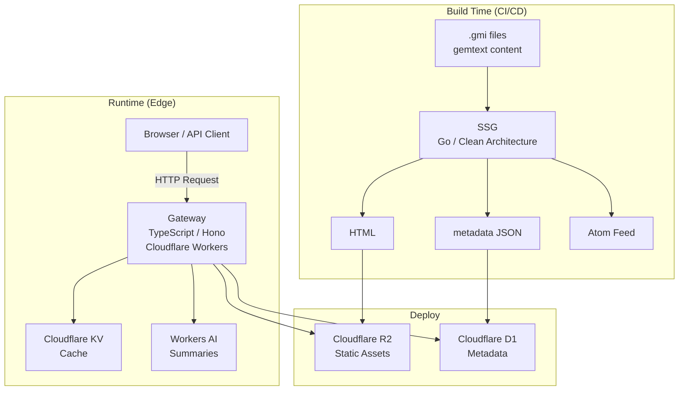
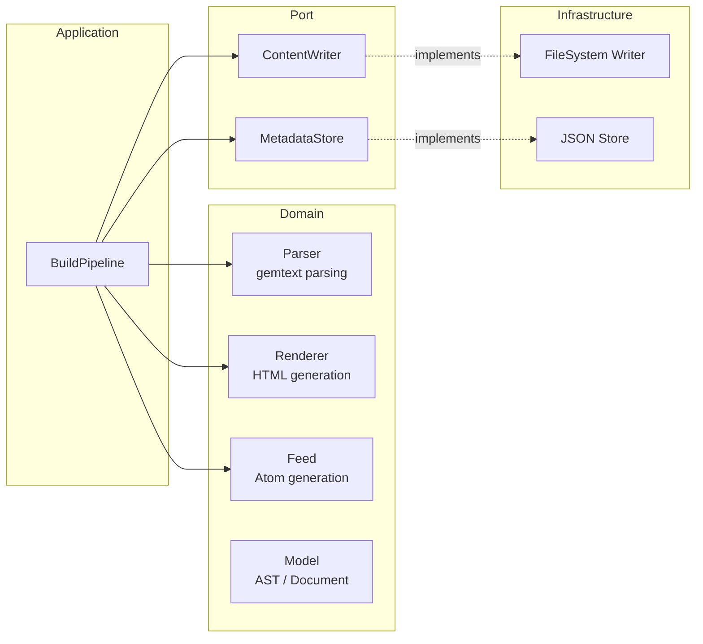
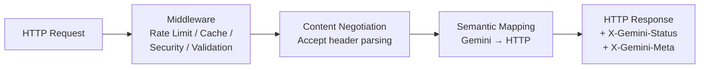

# gemini-bridge

**A protocol bridge that makes Gemini Protocol content accessible over HTTPS**

[](https://go.dev/)
[](https://www.typescriptlang.org/)
[](https://hono.dev/)
[](https://workers.cloudflare.com/)
[](LICENSE)
[]()

> [Japanese version (README.md)](README.md)

## Overview

The [Gemini Protocol](https://geminiprotocol.net/) is a minimalist alternative to the Web, but its requirement for a dedicated client creates a high barrier to entry.

**gemini-bridge** converts gemtext content into browser-accessible HTML while faithfully mapping Gemini semantics (status codes, meta information) to HTTP responses.

### Key Features

- **gemtext to HTML conversion**: A static site generator that parses `.gmi` files and produces semantic HTML
- **Gemini semantics preservation**: Every HTTP response includes `X-Gemini-Status` and `X-Gemini-Meta` headers
- **Content Negotiation**: Returns HTML, raw gemtext, or JSON metadata based on the `Accept` header
- **Zero-dependency Go SSG**: Built entirely with the Go standard library
- **Cloudflare Workers Gateway**: Edge-deployed for fast global delivery

## Architecture

The system consists of two components — SSG (build-time) and Gateway (runtime) — with strict separation of concerns.



### SSG (Static Site Generator) — Clean Architecture



**Why Clean Architecture?** Domain logic (gemtext parsing, HTML rendering) is fully decoupled from infrastructure, ensuring testability and extensibility.

### Gateway — Gemini-to-HTTP Protocol Bridge



## Gemini-to-HTTP Mapping

The core domain logic of gemini-bridge is the accurate mapping of Gemini's two-digit status codes to HTTP.

| Gemini Status | Category | HTTP Status | Notes |
|:---:|:---|:---:|:---|
| 10, 11 | INPUT | 200 | Returns HTML form |
| 20 | SUCCESS | 200 | Content delivery |
| 30 | REDIRECT (temp) | 302 | `Location` header |
| 31 | REDIRECT (perm) | 301 | `Location` header |
| 40, 41 | TEMPORARY FAILURE | 503 | `Retry-After: 300` |
| 42, 43 | CGI/PROXY ERROR | 502 | — |
| 44 | SLOW DOWN | 429 | `Retry-After` from meta |
| 50 | GONE | 410 | — |
| 51 | NOT FOUND | 404 | — |
| 52 | GONE | 410 | — |
| 53 | PROXY ERROR | 502 | — |
| 59 | BAD REQUEST | 400 | — |
| 60 | CLIENT CERT REQUIRED | 401 | `WWW-Authenticate` |
| 61, 62 | CERT NOT AUTHORIZED | 403 | — |

Every response includes custom headers:
- `X-Gemini-Status`: Original Gemini status code
- `X-Gemini-Meta`: Original Gemini meta line

### Content Negotiation

| Accept Header | Response |
|:---|:---|
| `text/html` | Pre-generated HTML from SSG |
| `text/gemini` | Raw gemtext source |
| `application/json` | Metadata JSON |

## Tech Stack

| Component | Technology | Notes |
|:---|:---|:---|
| SSG | Go 1.26 | **Zero external dependencies** — standard library only (`html/template`, `encoding/xml`, `testing`, etc.) |
| Gateway | TypeScript + Hono | Lightweight framework for Cloudflare Workers |
| Static Assets | Cloudflare R2 | S3-compatible object storage |
| Cache | Cloudflare KV | Edge-distributed KV store (also used for rate limiting) |
| Metadata | Cloudflare D1 | SQLite-based serverless database |
| AI Summaries | Cloudflare Workers AI | Automatic article summarization |
| Testing | `go test` / Vitest + Miniflare | Native test runners |

## Project Structure

```
gemini-bridge/
├── cmd/gemini-bridge/
│   └── main.go                    # CLI entrypoint (manual DI wiring)
├── internal/
│   ├── domain/
│   │   ├── model/
│   │   │   ├── node.go            # gemtext AST nodes (sealed interface)
│   │   │   └── document.go        # Document / FrontMatter / PostMeta / Site
│   │   ├── parser/
│   │   │   ├── gemtext.go         # gemtext parser (line-oriented state machine)
│   │   │   ├── gemtext_test.go
│   │   │   ├── frontmatter.go     # Front matter parser
│   │   │   └── frontmatter_test.go
│   │   ├── renderer/
│   │   │   ├── html.go            # HTML renderer (html/template)
│   │   │   └── html_test.go
│   │   └── feed/
│   │       ├── atom.go            # Atom feed generator
│   │       └── atom_test.go
│   ├── port/
│   │   ├── writer.go              # ContentWriter interface
│   │   └── metadata.go            # MetadataStore interface
│   ├── infrastructure/
│   │   ├── filesystem.go          # Filesystem implementation
│   │   └── jsonstore.go           # JSON metadata store implementation
│   └── application/
│       ├── config.go              # Build configuration
│       ├── pipeline.go            # BuildPipeline orchestration
│       └── pipeline_test.go
├── gateway/
│   └── src/
│       ├── index.ts               # Workers entrypoint
│       ├── domain/gemini/
│       │   ├── types.ts           # GeminiStatusCode / GeminiResponse
│       │   ├── semantics.ts       # mapGeminiToHttp() mapping
│       │   ├── negotiation.ts     # Content Negotiation
│       │   └── *.test.ts
│       ├── application/           # Use cases
│       ├── infrastructure/        # R2 / D1 / KV / Workers AI integration
│       ├── presentation/          # Middleware
│       └── config/                # Cloudflare Bindings type definitions
├── gemini-bridge 技術設計書.md      # Detailed design document (3,300+ lines, Japanese)
├── CLAUDE.md                      # AI assistant development guide
├── go.mod
└── LICENSE
```

## Getting Started

### Prerequisites

- Go 1.26+
- Node.js 20+ / npm (for Gateway tests)

### Building and Running the SSG

```bash
# Build
go build ./cmd/gemini-bridge/

# Run (specify gemtext directory to generate HTML)
./gemini-bridge -src ./content -out ./public
```

### Running Tests

```bash
# Go SSG: Run all tests
go test ./...

# Go SSG: Specific packages
go test ./internal/domain/parser/
go test ./internal/domain/renderer/
go test ./internal/domain/feed/
go test ./internal/application/

# Gateway: Run Vitest
cd gateway && npx vitest run
```

## Testing

### Testing Strategy

- **Focus on domain logic**: Comprehensive unit tests for parser, renderer, feed generation, and protocol mapping
- **No external test dependencies**: Go SSG uses only the standard `testing` package. Gateway uses Vitest + Miniflare to emulate the Cloudflare Workers environment
- **Table-driven tests**: Go side fully adopts the idiomatic `[]struct{ name, input, expected }` pattern

### Test Results

| Component | Test Count | Status |
|:---|:---:|:---:|
| Go SSG | 38 | All passing |
| Gateway | 25 | All passing |
| **Total** | **63** | **All passing** |

## Design Decisions

### Why Zero External Dependencies? (Go SSG)

The Go standard library provides everything needed for an SSG: `html/template`, `encoding/xml`, `net/url`, `testing`, and more. By eliminating external dependencies:

- **No supply chain risk**: Immune to vulnerabilities or breaking changes in third-party packages
- **Reproducible builds**: No external entries in `go.sum`, guaranteeing deterministic builds
- **Demonstrates Go proficiency**: Shows deep understanding of the language's standard library rather than reliance on frameworks

### Why Sealed Interface?

```go
type Node interface {
    nodeType() NodeType
    sealed()  // unexported → prevents external implementations
}
```

The gemtext specification defines exactly 6 line types. The sealed interface pattern provides compile-time type safety, structurally preventing invalid `Node` implementations.

### Why Separate Build-Time and Runtime?

- **SSG (build-time)**: Heavy operations (gemtext parsing, HTML rendering, feed generation) run in CI/CD
- **Gateway (runtime)**: Serves static assets at the edge, handling only protocol mapping

This separation minimizes Workers response time and eliminates cold start impact.

### Why KV-Based Rate Limiting?

KV was chosen over D1 (SQLite) because:

- KV supports distributed edge reads/writes with the low latency that rate limiting demands
- D1 is better suited for structured metadata queries — overkill for simple counter operations
- KV's TTL feature naturally expresses expiring counters

## Design Document

For detailed technical design, see [gemini-bridge 技術設計書.md](gemini-bridge%20技術設計書.md) (approximately 3,300 lines, Japanese). It covers requirements, architecture, API design, test specifications, and deployment procedures.

## License

[MIT License](LICENSE) - Copyright (c) 2026 P4suta
