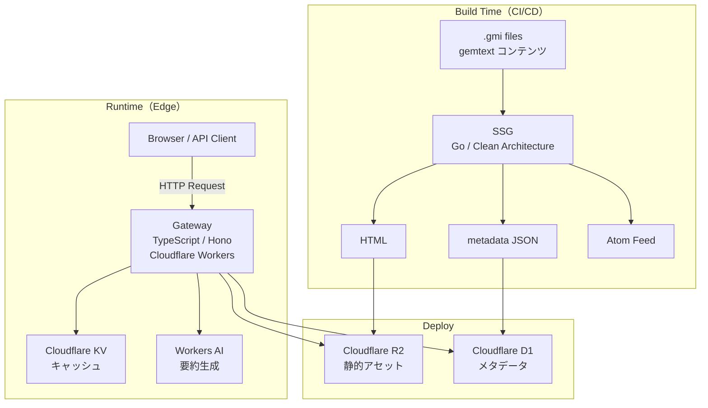
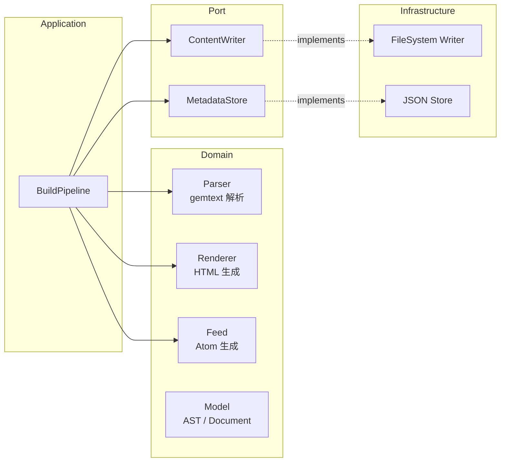
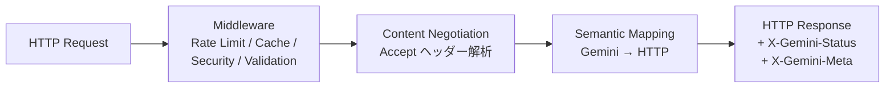

# gemini-bridge

**Gemini Protocol を HTTPS でアクセス可能にするプロトコルブリッジ**

[](https://go.dev/)
[](https://www.typescriptlang.org/)
[](https://hono.dev/)
[](https://workers.cloudflare.com/)
[](LICENSE)
[]()

> [English version (README.en.md)](README.en.md)

## Overview（概要）

[Gemini Protocol](https://geminiprotocol.net/) は Web の複雑さに対するミニマリストな代替プロトコルですが、専用クライアントが必要なため利用の敷居が高いという課題があります。

**gemini-bridge** は gemtext コンテンツを通常のブラウザからアクセス可能な HTML に変換し、Gemini のセマンティクス（ステータスコード・メタ情報）を HTTP レスポンスに忠実にマッピングするプロトコルブリッジです。

### 主な特徴

- **gemtext → HTML 変換**: `.gmi` ファイルを解析し、セマンティックな HTML を生成する静的サイトジェネレータ
- **Gemini セマンティクスの保存**: 全 HTTP レスポンスに `X-Gemini-Status` / `X-Gemini-Meta` ヘッダーを付与
- **Content Negotiation**: `Accept` ヘッダーに応じて HTML / 生 gemtext / JSON メタデータを返却
- **外部依存ゼロの Go SSG**: 標準ライブラリのみで構築
- **Cloudflare Workers ベースの Gateway**: エッジでの高速配信

## Architecture（アーキテクチャ）

SSG（ビルドタイム）と Gateway（ランタイム）の 2 コンポーネント構成で、関心の分離を徹底しています。



### SSG（静的サイトジェネレータ）— Clean Architecture



**Clean Architecture を採用した理由**: ドメインロジック（gemtext パース・HTML レンダリング）をインフラ層から完全に分離し、テスタビリティと拡張性を確保しています。

### Gateway — Gemini-to-HTTP プロトコルブリッジ



## Gemini-to-HTTP Mapping（プロトコルマッピング）

gemini-bridge のコアドメインロジックは、Gemini の 2 桁ステータスコードを HTTP に正確にマッピングすることです。

| Gemini Status | Category | HTTP Status | 補足 |
|:---:|:---|:---:|:---|
| 10, 11 | INPUT | 200 | HTML フォームを返却 |
| 20 | SUCCESS | 200 | コンテンツ配信 |
| 30 | REDIRECT (temp) | 302 | `Location` ヘッダー |
| 31 | REDIRECT (perm) | 301 | `Location` ヘッダー |
| 40, 41 | TEMPORARY FAILURE | 503 | `Retry-After: 300` |
| 42, 43 | CGI/PROXY ERROR | 502 | — |
| 44 | SLOW DOWN | 429 | `Retry-After` にメタ値 |
| 50 | GONE | 410 | — |
| 51 | NOT FOUND | 404 | — |
| 52 | GONE | 410 | — |
| 53 | PROXY ERROR | 502 | — |
| 59 | BAD REQUEST | 400 | — |
| 60 | CLIENT CERT REQUIRED | 401 | `WWW-Authenticate` |
| 61, 62 | CERT NOT AUTHORIZED | 403 | — |

全レスポンスに以下のカスタムヘッダーを付与:
- `X-Gemini-Status`: 元の Gemini ステータスコード
- `X-Gemini-Meta`: 元の Gemini メタ行

### Content Negotiation

| Accept ヘッダー | レスポンス |
|:---|:---|
| `text/html` | SSG 生成済み HTML |
| `text/gemini` | 生の gemtext ソース |
| `application/json` | メタデータ JSON |

## Tech Stack（技術スタック）

| コンポーネント | 技術 | 備考 |
|:---|:---|:---|
| SSG | Go 1.26 | **外部依存ゼロ**（`html/template`, `encoding/xml`, `testing` 等、標準ライブラリのみ） |
| Gateway | TypeScript + Hono | Cloudflare Workers 向け軽量フレームワーク |
| 静的アセット | Cloudflare R2 | S3 互換オブジェクトストレージ |
| キャッシュ | Cloudflare KV | エッジ分散 KV ストア（レート制限にも使用） |
| メタデータ | Cloudflare D1 | SQLite ベースのサーバーレス DB |
| AI 要約 | Cloudflare Workers AI | 記事要約の自動生成 |
| テスト | `go test` / Vitest + Miniflare | ネイティブテストランナー |

## Project Structure（プロジェクト構造）

```
gemini-bridge/
├── cmd/gemini-bridge/
│   └── main.go                    # CLI エントリーポイント（手動 DI）
├── internal/
│   ├── domain/
│   │   ├── model/
│   │   │   ├── node.go            # gemtext AST ノード（sealed interface）
│   │   │   └── document.go        # Document / FrontMatter / PostMeta / Site
│   │   ├── parser/
│   │   │   ├── gemtext.go         # gemtext パーサー（行指向ステートマシン）
│   │   │   ├── gemtext_test.go
│   │   │   ├── frontmatter.go     # Front Matter パーサー
│   │   │   └── frontmatter_test.go
│   │   ├── renderer/
│   │   │   ├── html.go            # HTML レンダラー（html/template）
│   │   │   └── html_test.go
│   │   └── feed/
│   │       ├── atom.go            # Atom フィード生成
│   │       └── atom_test.go
│   ├── port/
│   │   ├── writer.go              # ContentWriter インターフェース
│   │   └── metadata.go            # MetadataStore インターフェース
│   ├── infrastructure/
│   │   ├── filesystem.go          # ファイルシステム実装
│   │   └── jsonstore.go           # JSON メタデータストア実装
│   └── application/
│       ├── config.go              # ビルド設定
│       ├── pipeline.go            # BuildPipeline オーケストレーション
│       └── pipeline_test.go
├── gateway/
│   └── src/
│       ├── index.ts               # Workers エントリーポイント
│       ├── domain/gemini/
│       │   ├── types.ts           # GeminiStatusCode / GeminiResponse
│       │   ├── semantics.ts       # mapGeminiToHttp() マッピング
│       │   ├── negotiation.ts     # Content Negotiation
│       │   └── *.test.ts
│       ├── application/           # ユースケース
│       ├── infrastructure/        # R2 / D1 / KV / Workers AI 連携
│       ├── presentation/          # ミドルウェア群
│       └── config/                # Cloudflare Bindings 型定義
├── gemini-bridge 技術設計書.md      # 詳細設計書（3,300+ 行、日本語）
├── CLAUDE.md                      # AI アシスタント向け開発ガイド
├── go.mod
└── LICENSE
```

## Getting Started（使い方）

### 前提条件

- Go 1.26+
- Node.js 20+ / npm（Gateway のテスト実行時）

### SSG のビルドと実行

```bash
# ビルド
go build ./cmd/gemini-bridge/

# 実行（gemtext ディレクトリを指定して HTML 生成）
./gemini-bridge -src ./content -out ./public
```

### テスト実行

```bash
# Go SSG: 全テスト実行
go test ./...

# Go SSG: 特定パッケージ
go test ./internal/domain/parser/
go test ./internal/domain/renderer/
go test ./internal/domain/feed/
go test ./internal/application/

# Gateway: Vitest 実行
cd gateway && npx vitest run
```

## Testing（テスト）

### テスト方針

- **ドメインロジックを重点的にテスト**: パーサー・レンダラー・フィード生成・プロトコルマッピングの各ドメイン層に対して包括的なユニットテストを実装
- **外部依存なしのテスト**: Go SSG は標準ライブラリの `testing` パッケージのみ使用。Gateway は Vitest + Miniflare で Cloudflare Workers 環境をエミュレート
- **テーブル駆動テスト**: Go 側では慣用的な `[]struct{ name, input, expected }` パターンを全面的に採用

### テスト結果

| コンポーネント | テスト数 | 状態 |
|:---|:---:|:---:|
| Go SSG | 38 | All passing |
| Gateway | 25 | All passing |
| **合計** | **63** | **All passing** |

## Design Decisions（設計判断）

### なぜ外部依存ゼロか（Go SSG）

Go 標準ライブラリは `html/template`、`encoding/xml`、`net/url`、`testing` など、SSG に必要な機能を十分に提供しています。外部依存を排除することで:

- **サプライチェーンリスクの排除**: 依存パッケージの脆弱性や破壊的変更の影響を受けない
- **ビルドの再現性**: `go.sum` への外部エントリがなく、確定的ビルドが保証される
- **Go 言語理解の証明**: フレームワークに頼らず、言語の標準機能を深く活用できることを示す

### なぜ sealed interface か

```go
type Node interface {
    nodeType() NodeType
    sealed()  // unexported → 外部パッケージからの実装を防止
}
```

gemtext の行型は仕様で 6 種類に固定されています。sealed interface によりコンパイル時に型安全性を保証し、不正な Node 実装を構造的に排除します。

### なぜビルドタイムとランタイムを分離するか

- **SSG（ビルドタイム）**: 重い処理（gemtext パース、HTML レンダリング、フィード生成）を CI/CD で事前実行
- **Gateway（ランタイム）**: エッジで静的アセットを配信し、プロトコルマッピングのみを担当

この分離により Workers の応答時間を最小化し、コールドスタートの影響を排除しています。

### なぜ KV ベースのレート制限か

D1（SQLite）ではなく KV を選択した理由:

- KV はエッジで分散的に読み書きでき、レート制限に求められる低レイテンシ要件を満たす
- D1 はメタデータの構造化クエリに適しており、レート制限のような単純なカウンタ操作には過剰
- KV の TTL 機能により、有効期限付きカウンタを自然に表現できる

## 設計書

詳細な技術設計については [gemini-bridge 技術設計書.md](gemini-bridge%20技術設計書.md)（約 3,300 行、日本語）を参照してください。要件定義からアーキテクチャ、API 設計、テスト仕様、デプロイ手順まで網羅しています。

## License

[MIT License](LICENSE) - Copyright (c) 2026 P4suta
