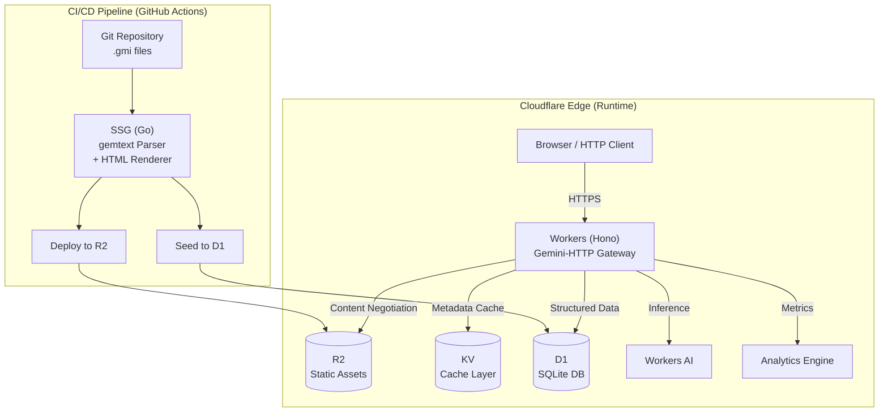
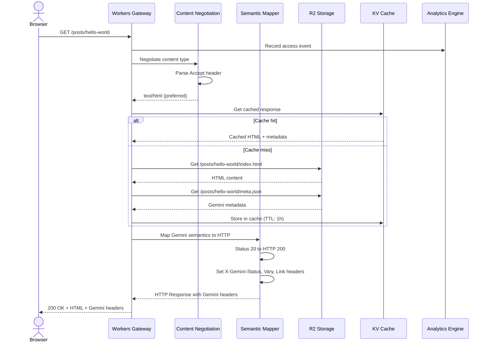
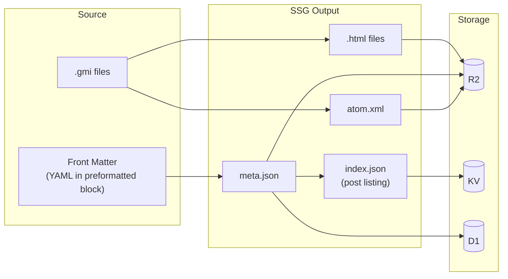
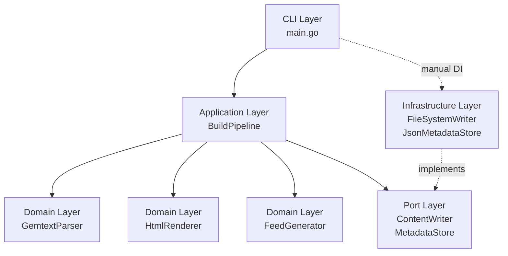
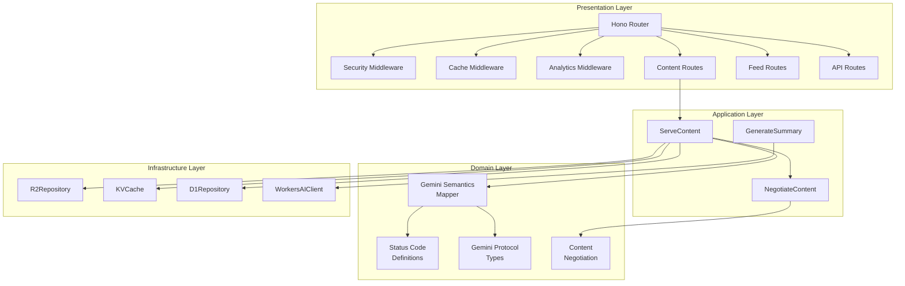
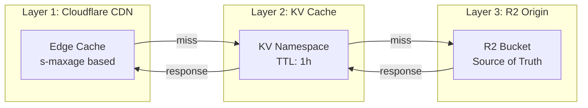
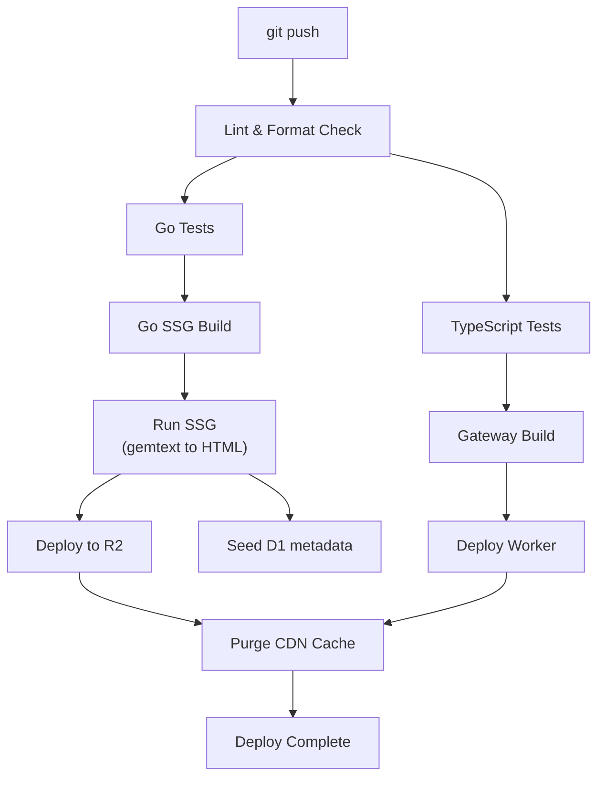

# gemini-bridge 技術設計書

<aside>
📋

**文書情報**

*プロジェクト名:* gemini-bridge

*バージョン:* 1.1.0

*著者:* 坂下 康信

*最終更新:* 2026-03-08

*ステータス:* Final

*改訂履歴:* v1.0.0 (2026-03-07) 初版作成 / v1.1.0 (2026-03-08) 正誤修正・補完実装追加・品質改善

</aside>

## 1. 概要

**gemini-bridge** は、Gemini Protocol上で記述されたgemtextコンテンツをHTTPS経由で配信するための、プロトコルブリッジシステムである。GeminiプロトコルのセマンティクスをHTTPの世界に正しくマッピングするゲートウェイレイヤーを設計の核とし、Cloudflareのエッジインフラストラクチャ上で完全サーバーレスに動作する。

**設計目標**

- Geminiプロトコルのステータスコード・リダイレクト・入力要求・Content Typeを、HTTPの対応するセマンティクスに忠実にマッピングする
- gemtextで記述したブログ記事を、Geminiクライアントなしにブラウザで閲覧可能にする
- SSG（静的サイト生成）をCI/CDパイプラインで実行し、ランタイムにビルド処理を持ち込まない
- Cloudflare無料枠の範囲内で、Workers・R2・KV・D1・Workers AIを活用した完全サーバーレスアーキテクチャを実現する
- ゼロ設定でビルド・デプロイが完結し、閲覧者はGeminiプロトコルの存在を意識せずにコンテンツを消費できる

---

## 2. 背景と課題

Gemini Protocolは2019年に提唱された軽量アプリケーション層プロトコルである。HTTPの肥大化したエコシステムに対するアンチテーゼとして設計され、TLS必須・単純なリクエスト/レスポンスモデル・行指向のマークアップ形式（gemtext）を特徴とする。ミニマリズムを追求した結果、Geminiは美しいプロトコル設計を持つが、普及面で根本的な問題を抱えている。

**課題1: アクセシビリティの壁**

Geminiコンテンツの閲覧には専用のGeminiクライアントが必要である。就活ポートフォリオとして技術ブログを公開する場合、採用担当者にGeminiクライアントのインストールを要求することは現実的ではない。

**課題2: 既存プロキシの不十分さ**

既存のGemini-to-HTTPプロキシ（例: Stargate）は、gemtextをHTMLに機械的に変換するだけであり、Geminiプロトコル固有のセマンティクス（ステータスコード体系、入力要求、クライアント証明書要求など）をHTTPに正しくマッピングしていない。プロトコルブリッジとしての設計思想が欠落している。

**課題3: ホスティングコスト**

従来のGeminiサーバーをECSやVPS上で常時稼働させることは、個人ブログとしてコスト効率が悪い。

<aside>
💡

**解決方針:** gemtextコンテンツをCI/CDパイプラインでHTMLにSSGし、Cloudflare Workersをゲートウェイレイヤーとしてデプロイする。ゲートウェイはGeminiプロトコルのセマンティクスを忠実にHTTPにマッピングし、Content Negotiationにより`text/gemini`と`text/html`の両方を提供する。Cloudflareの無料枠内で完結するサーバーレス構成により、ランニングコストをゼロにする。

</aside>

---

## 3. 要件定義

### 3.1 機能要件

- **FR-01** gemtext（`.gmi`）ファイルをパースし、セマンティックHTMLに変換するSSGを提供する
- **FR-02** Geminiプロトコルの全ステータスコード（1x, 2x, 3x, 4x, 5x, 6x）を対応するHTTPステータスコードにマッピングする
- **FR-03** Content Negotiationにより、`Accept: text/gemini`には生のgemtextを、`Accept: text/html`にはHTMLを返す
- **FR-04** gemtextの全行タイプ（テキスト、リンク、見出し1-3、リストアイテム、引用、プリフォーマット）を対応するHTML要素に変換する
- **FR-05** ブログ記事の一覧ページ、個別記事ページ、Atom/RSSフィードを自動生成する
- **FR-06** gemtextリンク行（`=>`）をHTMLアンカータグに変換し、外部リンクと内部リンクを区別する
- **FR-07** Geminiの`10 INPUT`レスポンスに対応するHTMLフォームUIを提供する
- **FR-08** Geminiの`30/31 REDIRECT`レスポンスに対応するHTTP 301/302リダイレクトを実装する
- **FR-09** Workers AIを用いた記事の自動要約・関連記事推薦・多言語対応を提供する
- **FR-10** `X-Gemini-Status`および`X-Gemini-Meta`カスタムHTTPヘッダーにより、元のGeminiレスポンス情報を保持する

### 3.2 非機能要件

- **NFR-01** Cloudflare無料枠（Workers 100K req/day、R2 10GB、KV 100K reads/day、D1 5GB）の範囲内で動作すること
- **NFR-02** Worker実行時間が無料枠のCPU時間制限（10ms）以内に収まること
- **NFR-03** TTFB（Time to First Byte）が全世界のエッジロケーションで100ms以内であること
- **NFR-04** CI/CDパイプラインによるビルド・デプロイが5分以内に完了すること
- **NFR-05** Lighthouseパフォーマンススコアが90以上であること
- **NFR-06** ゼロ設定で新規記事の追加・公開が可能であること（gemtextファイルをリポジトリに追加してpushするだけ）
- **NFR-07** セキュリティヘッダー（CSP, HSTS, X-Content-Type-Options等）を全レスポンスに付与すること

### 3.3 制約事項

- Geminiプロトコルのクライアント証明書認証（ステータスコード6x）は、HTTPSの世界では完全な再現が困難であるため、401/403レスポンスによる近似的マッピングに留める
- Workers AIの無料枠（10K inferences/day）の制約により、AI機能はビルドタイム生成とオンデマンドキャッシュの併用とする
- gemtextの`text/gemini`パラメータ`lang`はContent-Languageヘッダーにマッピングするが、`charset`は常にUTF-8固定とする

---

## 4. 技術スタック

### 4.1 SSGコンポーネント（ビルドタイム）

- **Go 1.22+**
    - 行指向パーサーとGoの簡潔な制御構造の親和性が高い
    - `html/template`が標準ライブラリにあり、外部テンプレートエンジン不要
    - シングルバイナリでCI環境との相性が良い
    - 選定理由: tategaki-spreadがJavaで実装済みであり、異なる言語での設計力を示すことがポートフォリオとしての幅を広げる
- **標準ライブラリのみ**
    - gemtextパーサー: 行指向ステートマシンを自前実装（外部パーサーライブラリ不使用）
    - HTMLレンダラー: `html/template`
    - ファイルI/O: `os`、`io`、`path/filepath`
    - テスト: `testing`標準パッケージ
    - 選定理由: Geminiの精神（ミニマリズム）に合致し、依存関係ゼロのビルドを実現。車輪の再発明ではなく、gemtextのシンプルさが自前パーサーを正当化する

### 4.2 ゲートウェイコンポーネント（ランタイム）

- **TypeScript 5.x**
    - Cloudflare Workers（V8 isolate）のネイティブ言語
    - R2/KV/D1/AIバインディングの型安全な利用
- **Hono 4.x**
    - Cloudflare Workers向けに最適化された軽量Webフレームワーク
    - ミドルウェアチェーンによるクリーンなリクエスト処理パイプライン
    - 選定理由: Workers環境でのデファクトスタンダード。Express風のAPIで学習コストが低く、バンドルサイズが極小（14KB）
- **Wrangler 3.x**
    - Cloudflare Workers公式CLI。ローカル開発・デプロイ・バインディング管理を統合

### 4.3 インフラストラクチャ

- **Cloudflare Workers**: ゲートウェイ本体（100K req/day無料）
- **Cloudflare R2**: ビルド済みアセット格納（10GB無料、S3互換API）
- **Cloudflare KV**: メタデータキャッシュ・サイト設定（1GB無料、100K reads/day）
- **Cloudflare D1**: 記事メタデータ・アクセス解析（SQLite、5GB無料）
- **Cloudflare Workers AI**: 記事要約・関連記事推薦（10K inferences/day無料）
- **Cloudflare Analytics Engine**: カスタムアクセス解析（無制限カーディナリティ）

### 4.4 CI/CD

- **GitHub Actions**
    - SSGビルド、テスト、R2デプロイ、Workersデプロイを一気通貫で実行
    - Cloudflare Pages Builds（3,000 build min/month無料）も選択肢だが、Go SSGの柔軟性を活かすためGitHub Actionsを採用

### 4.5 テスト

- **Go**: `testing`標準パッケージ + `testify`（アサーション拡張のみ最小限使用）
- **TypeScript**: Vitest + Miniflare（Workers環境のローカルエミュレーション）

---

## 5. システムアーキテクチャ設計

### 5.1 設計原則

- **ビルドタイムとランタイムの責務分離**: gemtextパース・HTML生成はCI/CDで完結し、Workersはプロトコルブリッジとコンテンツ配信に専念する。これによりWorkerのCPU時間を最小化し、無料枠内での運用を保証する
- **クリーンアーキテクチャ**: SSG・ゲートウェイの両コンポーネントで、ドメインロジックを外部依存から隔離する。SSGではGo interfaceによるPort定義、ゲートウェイではTypeScript interfaceによる依存性逆転を適用する
- **プロトコルファースト設計**: Geminiプロトコル仕様を第一級の設計要素として扱い、HTTP変換はGeminiセマンティクスの忠実な写像として定義する。実装の都合でプロトコルセマンティクスを歪めない
- **エッジファースト**: 全てのレスポンスはCloudflareのエッジロケーションから配信される。オリジンサーバーは存在しない
- **標準機能優先**: 外部ライブラリの採用は、標準ライブラリでの実装が非合理的な場合に限定する

### 5.2 全体構成図



### 5.3 リクエスト処理フロー



### 5.4 データフロー



---

## 6. Geminiプロトコルセマンティクスマッピング

この章が本プロジェクトの設計の核心である。GeminiプロトコルのレスポンスセマンティクスをHTTPに忠実にマッピングするルールを定義する。

### 6.1 設計方針

Geminiプロトコルのレスポンスは、2桁のステータスコードとメタ情報（MIME typeまたはメッセージ）で構成される。HTTPのレスポンスモデル（ステータスコード + ヘッダー + ボディ）はGeminiよりも表現力が豊かであるため、マッピングは情報を失うことなく実現できる。

**原則:**

1. Geminiのステータスコードの意図をHTTPステータスコードに可能な限り正確に写像する
2. HTTPの追加表現力（ヘッダー）を用いて、元のGeminiセマンティクスを保持する
3. ブラウザが自然に処理できるHTTPレスポンスを生成する（Gemini固有の概念はHTMLに変換）

### 6.2 ステータスコードマッピング

**1x INPUT系:**

- `10 INPUT` → HTTP `200 OK` + HTMLフォーム（`<form>`に`<input type="text">`）
- `11 SENSITIVE INPUT` → HTTP `200 OK` + HTMLフォーム（`<form>`に`<input type="password">`）
- 設計判断: HTTP `200`を返す理由は、ブラウザがフォームをレンダリングできるようにするため。Geminiの「入力を要求する」というセマンティクスを、HTMLフォームのインタラクションに変換する

**2x SUCCESS系:**

- `20 SUCCESS` → HTTP `200 OK` + Content-Type変換（text/geminiをtext/htmlに、またはAcceptに応じて生gemtextを返す）

**3x REDIRECT系:**

- `30 REDIRECT - TEMPORARY` → HTTP `302 Found` + `Location`ヘッダー
- `31 REDIRECT - PERMANENT` → HTTP `301 Moved Permanently` + `Location`ヘッダー
- 設計判断: Geminiのリダイレクト先がgemini://スキームの場合、HTTPSスキームに自動変換する。外部Geminiサーバーの場合はGeminiプロキシURL経由に変換する

**4x TEMPORARY FAILURE系:**

- `40 TEMPORARY FAILURE` → HTTP `503 Service Unavailable` + `Retry-After`ヘッダー
- `41 SERVER UNAVAILABLE` → HTTP `503 Service Unavailable` + `Retry-After`ヘッダー
- `42 CGI ERROR` → HTTP `502 Bad Gateway`
- `43 PROXY ERROR` → HTTP `502 Bad Gateway`
- `44 SLOW DOWN` → HTTP `429 Too Many Requests` + `Retry-After`ヘッダー（Geminiのmeta値を秒数として使用）

**5x PERMANENT FAILURE系:**

- `50 PERMANENT FAILURE` → HTTP `410 Gone`
- `51 NOT FOUND` → HTTP `404 Not Found`
- `52 GONE` → HTTP `410 Gone`
- `53 PROXY REQUEST REFUSED` → HTTP `502 Bad Gateway`
- `59 BAD REQUEST` → HTTP `400 Bad Request`

**6x CLIENT CERTIFICATE系:**

- `60 CLIENT CERTIFICATE REQUIRED` → HTTP `401 Unauthorized` + `WWW-Authenticate`ヘッダー
- `61 CERTIFICATE NOT AUTHORISED` → HTTP `403 Forbidden`
- `62 CERTIFICATE NOT VALID` → HTTP `403 Forbidden`
- 設計判断: Geminiのクライアント証明書はHTTPSのmTLSに概念的に対応するが、ブラウザでの一般的なフローではないため、情報提示に留める

### 6.3 ヘッダーマッピング

全てのレスポンスに以下のカスタムヘッダーを付与し、元のGeminiセマンティクスを保持する:

- `X-Gemini-Status`: 元のGeminiステータスコード（例: `20`）
- `X-Gemini-Meta`: 元のGeminiメタ情報（例: `text/gemini; lang=ja`）
- `Link`: `<{path}.gmi>; rel="alternate"; type="text/gemini"` により、生gemtextへの代替アクセスを提示
- `Vary: Accept` によりContent Negotiationをキャッシュに正しく反映
- `Content-Language`: gemtextの`lang`パラメータから導出

### 6.4 Content Negotiation

`Accept`ヘッダーに基づいてレスポンス形式を決定する:

- `text/html`（ブラウザのデフォルト）→ SSGで生成済みのHTMLを返却
- `text/gemini` → R2から生の`.gmi`ファイルを返却
- `application/json` → 記事メタデータ（タイトル、日付、要約、タグ）をJSON形式で返却
- `*/*`またはAcceptヘッダーなし → `text/html`をデフォルトとする

```tsx
// domain/gemini/negotiation.ts
export type ContentFormat = 'html' | 'gemtext' | 'json';

export function negotiateFormat(acceptHeader: string | null): ContentFormat {
  if (!acceptHeader || acceptHeader === '*/*') return 'html';

  const mediaTypes = parseAcceptHeader(acceptHeader);

  for (const { type, quality } of mediaTypes) {
    if (type === 'text/gemini') return 'gemtext';
    if (type === 'text/html') return 'html';
    if (type === 'application/json') return 'json';
  }

  return 'html';
}

interface MediaType {
  type: string;
  quality: number;
}

function parseAcceptHeader(header: string): MediaType[] {
  return header
    .split(',')
    .map((part) => {
      const [type, ...params] = part.trim().split(';');
      const qParam = params.find((p) => p.trim().startsWith('q='));
      const quality = qParam ? parseFloat(qParam.split('=')[1]) : 1.0;
      return { type: type.trim(), quality };
    })
    .sort((a, b) => b.quality - a.quality);
}
```

### 6.5 Geminiレスポンスモデル（ドメイン型定義）

```tsx
// domain/gemini/types.ts

/** Geminiステータスコードのカテゴリ */
export type GeminiStatusCategory =
  | 'INPUT'
  | 'SUCCESS'
  | 'REDIRECT'
  | 'TEMPORARY_FAILURE'
  | 'PERMANENT_FAILURE'
  | 'CLIENT_CERTIFICATE';

/** Geminiステータスコード（2桁整数） */
export type GeminiStatusCode =
  | 10 | 11
  | 20
  | 30 | 31
  | 40 | 41 | 42 | 43 | 44
  | 50 | 51 | 52 | 53 | 59
  | 60 | 61 | 62;

/** Geminiレスポンスの抽象表現 */
export interface GeminiResponse {
  readonly status: GeminiStatusCode;
  readonly meta: string;
  readonly body?: ReadableStream | null;
}

/** ステータスコードからカテゴリを導出 */
export function statusCategory(code: GeminiStatusCode): GeminiStatusCategory {
  const tens = Math.floor(code / 10);
  switch (tens) {
    case 1: return 'INPUT';
    case 2: return 'SUCCESS';
    case 3: return 'REDIRECT';
    case 4: return 'TEMPORARY_FAILURE';
    case 5: return 'PERMANENT_FAILURE';
    case 6: return 'CLIENT_CERTIFICATE';
    default: throw new Error(`Unknown Gemini status category: ${code}`);
  }
}
```

### 6.6 セマンティクスマッパー

```tsx
// domain/gemini/semantics.ts
import type { GeminiResponse, GeminiStatusCode } from './types';

export interface HttpMapping {
  readonly httpStatus: number;
  readonly headers: Record<string, string>;
  readonly transformBody: boolean;
}

const STATUS_MAP: Record<GeminiStatusCode, number> = {
  10: 200, 11: 200,
  20: 200,
  30: 302, 31: 301,
  40: 503, 41: 503, 42: 502, 43: 502, 44: 429,
  50: 410, 51: 404, 52: 410, 53: 502, 59: 400,
  60: 401, 61: 403, 62: 403,
};

export function mapGeminiToHttp(gemini: GeminiResponse): HttpMapping {
  const httpStatus = STATUS_MAP[gemini.status];
  const headers: Record<string, string> = {
    'X-Gemini-Status': String(gemini.status),
    'X-Gemini-Meta': gemini.meta,
  };

  // 3x REDIRECT: Locationヘッダーにリダイレクト先を設定
  if (gemini.status === 30 || gemini.status === 31) {
    headers['Location'] = translateGeminiUrl(gemini.meta);
  }

  // 44 SLOW DOWN: Retry-Afterヘッダーに秒数を設定
  if (gemini.status === 44) {
    headers['Retry-After'] = gemini.meta;
  }

  // 4x TEMPORARY FAILURE: デフォルトRetry-After
  if (gemini.status === 40 || gemini.status === 41) {
    headers['Retry-After'] = '300';
  }

  // 60 CLIENT CERTIFICATE: WWW-Authenticateヘッダー
  if (gemini.status === 60) {
    headers['WWW-Authenticate'] =
      'GeminiCert realm="Gemini client certificate required"';
  }

  return {
    httpStatus,
    headers,
    transformBody: gemini.status === 20,
  };
}

/**
 * gemini:// URLをhttps:// URLに変換する。
 * 自サイト内リンクは直接変換、外部Geminiリンクはプロキシ経由に変換。
 */
function translateGeminiUrl(url: string): string {
  if (!url.startsWith('gemini://')) return url;

  const parsed = new URL(url);
    // 自サイトのGeminiアドレスの場合は直接HTTPS変換
  // 外部の場合はそのまま返す（将来的にプロキシ経由に拡張可能）
  return 'https://' + parsed.host + parsed.pathname + parsed.search;
}
```

---

## 7. SSGコンポーネント設計（Go）

SSGコンポーネントはgemtextファイルをパースし、HTMLおよびメタデータに変換するCLIツールである。CI/CDパイプラインで実行され、出力はR2およびD1にデプロイされる。

### 7.1 アーキテクチャ



### 7.2 パッケージ構造

```go
gemini-bridge/
├── cmd/
│   └── gemini-bridge/
│       └── main.go               // CLIエントリポイント
├── internal/
│   ├── domain/
│   │   ├── model/
│   │   │   ├── node.go            // gemtext ASTノード型
│   │   │   ├── document.go        // gemtext文書モデル
│   │   │   ├── frontmatter.go     // Front Matter
│   │   │   └── site.go            // サイト全体モデル
│   │   ├── parser/
│   │   │   ├── gemtext.go         // gemtextパーサー
│   │   │   ├── gemtext_test.go
│   │   │   ├── frontmatter.go     // Front Matterパーサー
│   │   │   └── frontmatter_test.go
│   │   ├── renderer/
│   │   │   ├── html.go            // HTMLレンダラー
│   │   │   ├── html_test.go
│   │   │   └── templates/         // Go html/template
│   │   │       ├── base.html
│   │   │       ├── post.html
│   │   │       └── index.html
│   │   └── feed/
│   │       ├── atom.go            // Atomフィード生成
│   │       └── atom_test.go
│   ├── port/
│   │   ├── writer.go              // ContentWriterインターフェース
│   │   └── metadata.go            // MetadataStoreインターフェース
│   ├── infrastructure/
│   │   ├── filesystem.go          // ファイルシステム書き出し
│   │   └── jsonstore.go           // JSONメタデータ生成
│   └── application/
│       ├── pipeline.go            // ビルドパイプライン
│       ├── config.go              // ビルド設定
│       └── pipeline_test.go
└── go.mod
```

### 7.3 ドメインモデル

#### gemtext ASTノード

gemtextは本質的にフラット（非階層的）な行指向フォーマットであるため、ASTノードは再帰構造を持たない平坦なスライスで表現する。Go言語ではsealed interfaceに相当する機能がないため、unexportedメソッドを持つinterfaceで外部パッケージからの実装を防ぐ。

```go
// internal/domain/model/node.go
package model

// Node はgemtext行の抽象表現。
// unexportedメソッド sealed() により外部パッケージからの実装を防ぐ。
type Node interface {
	nodeType() NodeType
	sealed()
}

type NodeType int

const (
	NodeText NodeType = iota
	NodeLink
	NodeHeading
	NodeListItem
	NodeQuote
	NodePreformatted
)

// Text は通常のテキスト行。
type Text struct {
	Content string
}

func (Text) nodeType() NodeType { return NodeText }
func (Text) sealed()            {}

// Link はリンク行（=> URL label）。
type Link struct {
	URL   string
	Label string // 空の場合はURLをラベルとして表示
}

func (Link) nodeType() NodeType { return NodeLink }
func (Link) sealed()            {}

// Heading は見出し行（#, ##, ###）。
type Heading struct {
	Level   int // 1, 2, or 3
	Content string
}

func (Heading) nodeType() NodeType { return NodeHeading }
func (Heading) sealed()            {}

// ListItem はリスト項目行（* item）。
type ListItem struct {
	Content string
}

func (ListItem) nodeType() NodeType { return NodeListItem }
func (ListItem) sealed()            {}

// Quote は引用行（> text）。
type Quote struct {
	Content string
}

func (Quote) nodeType() NodeType { return NodeQuote }
func (Quote) sealed()            {}

// Preformatted はプリフォーマットブロック（```で囲まれた範囲）。
// gemtextでは複数行にまたがる唯一のブロック型。
type Preformatted struct {
	AltText string   // ``` に続くalt text（言語ヒント等）
	Lines   []string // ブロック内の各行
}

func (Preformatted) nodeType() NodeType { return NodePreformatted }
func (Preformatted) sealed()            {}
```

#### 文書モデル

```go
// internal/domain/model/document.go
package model

import "time"

// Document はパース済みのgemtext文書を表す。
type Document struct {
	FrontMatter FrontMatter
	Nodes       []Node
}

// FrontMatter はgemtextファイル冒頭のメタデータ。
// プリフォーマットブロック内にYAML形式で記述する規約とする。
type FrontMatter struct {
	Title       string    `yaml:"title"`
	Date        time.Time `yaml:"date"`
	Slug        string    `yaml:"slug"`
	Tags        []string  `yaml:"tags"`
	Language    string    `yaml:"lang"`
	Description string    `yaml:"description"`
	Draft       bool      `yaml:"draft"`
}

// PostMeta はビルド後に生成される記事メタデータ。
// JSONシリアライズしてR2/D1に格納する。
type PostMeta struct {
	Slug        string    `json:"slug"`
	Title       string    `json:"title"`
	Date        time.Time `json:"date"`
	Tags        []string  `json:"tags"`
	Language    string    `json:"lang"`
	Description string    `json:"description"`
	WordCount   int       `json:"wordCount"`
	GemtextHash string    `json:"gemtextHash"`
}

// Site はサイト全体の情報を保持する。
type Site struct {
	Title    string
	Subtitle string
	BaseURL  string
	Author   string
	Language string
	Posts    []PostMeta
}
```

### 7.4 gemtextパーサー

gemtextは行指向のフォーマットであるため、パーサーは1行ずつ読み進めるステートマシンとして実装する。唯一の状態遷移はプリフォーマットブロックのトグル（ `` `行で開始/終了）のみ。

<aside>
💡

**設計ノート:** gemtextの仕様上、プリフォーマットブロック外の行は全て独立に解釈できる（前後の行に依存しない）。この性質がステートマシンを極めて単純に保つ。状態は「通常モード」と「プリフォーマットモード」の2つだけである。

</aside>

```go
// internal/domain/parser/gemtext.go
package parser

import (
	"bufio"
	"io"
	"strings"

	"gemini-bridge/internal/domain/model"
)

// Parse はgemtextのReaderを受け取り、Nodeのスライスを返す。
// Front Matterの解析は呼び出し側の責務とし、本関数は純粋なgemtextパースに専念する。
func Parse(r io.Reader) ([]model.Node, error) {
	var nodes []model.Node
	scanner := bufio.NewScanner(r)

	var inPreformatted bool
	var preBlock model.Preformatted

	for scanner.Scan() {
		line := scanner.Text()

		// プリフォーマットトグル判定
		if strings.HasPrefix(line, "```") {
			if inPreformatted {
				// ブロック終了: 蓄積した行をノードとして追加
				nodes = append(nodes, preBlock)
				preBlock = model.Preformatted{}
				inPreformatted = false
			} else {
				// ブロック開始: alt textを取得
				preBlock.AltText = strings.TrimSpace(line[3:])
				inPreformatted = true
			}
			continue
		}

		// プリフォーマットモード中は行をそのまま蓄積
		if inPreformatted {
			preBlock.Lines = append(preBlock.Lines, line)
			continue
		}

		// 通常モード: 行頭の文字列パターンで分岐
		node := parseLine(line)
		nodes = append(nodes, node)
	}

	// ファイル末尾で閉じられていないプリフォーマットブロックの処理
	if inPreformatted {
		nodes = append(nodes, preBlock)
	}

	return nodes, scanner.Err()
}

// parseLine は通常モードの1行をパースして適切なNodeを返す。
func parseLine(line string) model.Node {
	// リンク行: => URL optional-label
	if strings.HasPrefix(line, "=>") {
		return parseLink(line[2:])
	}

	// 見出し行: ###, ##, # の順にチェック（長い方を先に）
	if strings.HasPrefix(line, "###") {
		return model.Heading{Level: 3, Content: strings.TrimSpace(line[3:])}
	}
	if strings.HasPrefix(line, "##") {
		return model.Heading{Level: 2, Content: strings.TrimSpace(line[2:])}
	}
	if strings.HasPrefix(line, "#") {
		return model.Heading{Level: 1, Content: strings.TrimSpace(line[1:])}
	}

	// リストアイテム: * text
	if strings.HasPrefix(line, "* ") {
		return model.ListItem{Content: strings.TrimSpace(line[2:])}
	}

	// 引用行: > text
	if strings.HasPrefix(line, ">") {
		return model.Quote{Content: strings.TrimSpace(line[1:])}
	}

	// その他: テキスト行
	return model.Text{Content: line}
}

// parseLink はリンク行の URL と label を分離する。
func parseLink(raw string) model.Link {
	trimmed := strings.TrimSpace(raw)
	if trimmed == "" {
		return model.Link{}
	}

	// 最初の空白文字でURLとラベルを分割
	parts := strings.SplitN(trimmed, " ", 2)
	url := parts[0]

	var label string
	if len(parts) > 1 {
		label = strings.TrimSpace(parts[1])
	}

	// タブ区切りも考慮
	if label == "" {
		tabParts := strings.SplitN(trimmed, "\t", 2)
		url = tabParts[0]
		if len(tabParts) > 1 {
			label = strings.TrimSpace(tabParts[1])
		}
	}

	return model.Link{URL: url, Label: label}
}
```

### 7.5 Front Matterパーサー

gemtextにはMarkdownのようなFront Matter規約が存在しないため、本プロジェクトでは独自の規約を定義する。ファイル冒頭のプリフォーマットブロック（alt textが`yaml`のもの）をFront Matterとして解釈する。

gemtextファイルの先頭に、alt textが`yaml`のプリフォーマットブロックを配置し、その中にYAML形式でメタデータを記述する:

```yaml
title: Hello World
date: 2024-01-15
tags: tech, gemini
lang: ja
```

上記YAMLブロックの前後をgemtextのプリフォーマットトグル行（3連バッククォート）で囲む規約とする。トグル行のalt textに`yaml`を指定することで、Front Matterブロックであることをパーサーに明示する。プリフォーマットブロック後の通常gemtextコンテンツが記事本文となる。

```go
// internal/domain/parser/frontmatter.go
package parser

import (
	"fmt"
	"strings"
	"time"

	"gemini-bridge/internal/domain/model"
)

// ExtractFrontMatter はNodeスライスの先頭からFront Matterを抽出する。
// 先頭のPreformattedノードのAltTextが "yaml" の場合にFront Matterとして解釈する。
// 戻り値は、FrontMatter構造体と、Front Matterを除いた残りのNodeスライス。
func ExtractFrontMatter(nodes []model.Node) (model.FrontMatter, []model.Node) {
	if len(nodes) == 0 {
		return model.FrontMatter{}, nodes
	}

	pre, ok := nodes[0].(model.Preformatted)
	if !ok || !strings.EqualFold(pre.AltText, "yaml") {
		return model.FrontMatter{}, nodes
	}

	fm := parseFrontMatterLines(pre.Lines)
	return fm, nodes[1:]
}

// parseFrontMatterLines は key: value 形式の行をパースする。
// 外部YAMLライブラリに依存せず、サポートするフィールドに限定した軽量パーサー。
func parseFrontMatterLines(lines []string) model.FrontMatter {
	var fm model.FrontMatter

	for _, line := range lines {
		key, value, ok := parseKeyValue(line)
		if !ok {
			continue
		}

		switch key {
		case "title":
			fm.Title = value
		case "date":
			if t, err := time.Parse("2006-01-02", value); err == nil {
				fm.Date = t
			}
		case "slug":
			fm.Slug = value
		case "tags":
			for _, tag := range strings.Split(value, ",") {
				tag = strings.TrimSpace(tag)
				if tag != "" {
					fm.Tags = append(fm.Tags, tag)
				}
			}
		case "lang":
			fm.Language = value
		case "description":
			fm.Description = value
		case "draft":
			fm.Draft = value == "true"
		}
	}

	// デフォルト値の設定
	if fm.Language == "" {
		fm.Language = "ja"
	}

	return fm
}

func parseKeyValue(line string) (key, value string, ok bool) {
	idx := strings.Index(line, ":")
	if idx < 0 {
		return "", "", false
	}
	key = strings.TrimSpace(line[:idx])
	value = strings.TrimSpace(line[idx+1:])
	return key, value, key != ""
}
```

<aside>
⚠️

**外部YAMLライブラリを使用しない理由:** Front Matterのフィールドは有限かつ固定であり、ネストや複雑な型を持たない。`key: value`のフラットなパースで十分であり、`gopkg.in/yaml.v3`への依存を追加する合理性がない。これはgemtextのミニマリズムの精神にも合致する。ただし、フィールド追加の頻度が増えた場合は、YAMLライブラリへの移行を検討する。

</aside>

### 7.6 HTMLレンダラー

NodeスライスをHTML文字列に変換するレンダラー。`html/template`を使用してXSSを防止する。

```go
// internal/domain/renderer/html.go
package renderer

import (
	"fmt"
	"html"
	"strings"

	"gemini-bridge/internal/domain/model"
)

// RenderNodes はNodeスライスをHTML文字列に変換する。
func RenderNodes(nodes []model.Node) string {
	var b strings.Builder
	var inList bool

	for _, node := range nodes {
		// リストの開始/終了タグ管理
		isListItem := false
		if _, ok := node.(model.ListItem); ok {
			isListItem = true
		}

		if inList && !isListItem {
			b.WriteString("</ul>\n")
			inList = false
		}

		switch n := node.(type) {
		case model.Text:
			if n.Content == "" {
				b.WriteString("<br>\n")
			} else {
				fmt.Fprintf(&b, "<p>%s</p>\n", html.EscapeString(n.Content))
			}

		case model.Link:
			label := n.Label
			if label == "" {
				label = n.URL
			}
			escURL := html.EscapeString(n.URL)
			escLabel := html.EscapeString(label)
			// gemini:// リンクはHTTPS変換
			displayURL := convertGeminiURL(escURL)
			fmt.Fprintf(&b, "<p class=\"gemini-link\"><a href=\"%s\">%s</a></p>\n",
				displayURL, escLabel)

		case model.Heading:
			esc := html.EscapeString(n.Content)
			slug := slugify(n.Content)
			fmt.Fprintf(&b, "<h%d id=\"%s\">%s</h%d>\n",
				n.Level, slug, esc, n.Level)

		case model.ListItem:
			if !inList {
				b.WriteString("<ul>\n")
				inList = true
			}
			fmt.Fprintf(&b, "  <li>%s</li>\n", html.EscapeString(n.Content))

		case model.Quote:
			fmt.Fprintf(&b, "<blockquote><p>%s</p></blockquote>\n",
				html.EscapeString(n.Content))

		case model.Preformatted:
			b.WriteString("<pre")
			if n.AltText != "" {
				fmt.Fprintf(&b, " aria-label=\"%s\"", html.EscapeString(n.AltText))
			}
			b.WriteString("><code>")
			for i, line := range n.Lines {
				if i > 0 {
					b.WriteString("\n")
				}
				b.WriteString(html.EscapeString(line))
			}
			b.WriteString("</code></pre>\n")
		}
	}

	if inList {
		b.WriteString("</ul>\n")
	}

	return b.String()
}

// convertGeminiURL は gemini:// URLを https:// に変換する。
func convertGeminiURL(url string) string {
	if strings.HasPrefix(url, "gemini://") {
		return "https://" + url[9:]
	}
	return url
}

// slugify は見出しテキストからURL-safeなスラグを生成する。
func slugify(s string) string {
	s = strings.ToLower(s)
	s = strings.Map(func(r rune) rune {
		if (r >= 'a' && r <= 'z') || (r >= '0' && r <= '9') || r == '-' || r > 127 {
			return r
		}
		if r == ' ' {
			return '-'
		}
		return -1
	}, s)
	return s
}
```

### 7.7 ポート層

```go
// internal/port/writer.go
package port

import "io"

// ContentWriter はビルド成果物の書き出し先を抽象化するインターフェース。
// ファイルシステム、R2直接アップロード、テスト用バッファなどの実装を差し替え可能にする。
type ContentWriter interface {
	// Write は指定パスにコンテンツを書き出す。
	Write(path string, content io.Reader) error

	// WriteBytes は指定パスにバイト列を書き出す。
	WriteBytes(path string, data []byte) error
}
```

```go
// internal/port/metadata.go
package port

import "gemini-bridge/internal/domain/model"

// MetadataStore は記事メタデータの永続化を抽象化するインターフェース。
type MetadataStore interface {
	// SavePostMeta は個別記事のメタデータを永続化する。
	SavePostMeta(meta model.PostMeta) error

	// SaveSiteIndex はサイト全体の記事インデックスを永続化する。
	SaveSiteIndex(posts []model.PostMeta) error
}
```

### 7.8 ビルドパイプライン

```go
// internal/application/pipeline.go
package application

import (
	"crypto/sha256"
	"fmt"
	"io"
	"log"
	"os"
	"path/filepath"
	"sort"
	"strings"
	"unicode/utf8"

	"gemini-bridge/internal/domain/model"
	"gemini-bridge/internal/domain/parser"
	"gemini-bridge/internal/domain/renderer"
	"gemini-bridge/internal/domain/feed"
	"gemini-bridge/internal/port"
)

// BuildPipeline はgemtextからの静的サイト生成を統括する。
type BuildPipeline struct {
	writer   port.ContentWriter
	metaStore port.MetadataStore
	config   BuildConfig
}

type BuildConfig struct {
	SourceDir  string // gemtextファイルのルートディレクトリ
	OutputDir  string // ビルド出力ディレクトリ
	SiteTitle  string
	SiteURL    string
	Author     string
}

func NewBuildPipeline(
	writer port.ContentWriter,
	metaStore port.MetadataStore,
	config BuildConfig,
) *BuildPipeline {
	return &BuildPipeline{
		writer:    writer,
		metaStore: metaStore,
		config:    config,
	}
}

// Execute はビルドパイプライン全体を実行する。
func (p *BuildPipeline) Execute() error {
	// 1. 全gemtextファイルを収集
	gmiFiles, err := p.collectGemtextFiles()
	if err != nil {
		return fmt.Errorf("failed to collect gemtext files: %w", err)
	}

	log.Printf("Found %d gemtext files", len(gmiFiles))

	// 2. 各ファイルをパース・変換
	var posts []model.PostMeta
	for _, path := range gmiFiles {
		meta, err := p.processFile(path)
		if err != nil {
			return fmt.Errorf("failed to process %s: %w", path, err)
		}
		if meta.Slug != "" {
			posts = append(posts, meta)
		}
	}

	// 3. 日付降順にソート
	sort.Slice(posts, func(i, j int) bool {
		return posts[i].Date.After(posts[j].Date)
	})

	// 4. インデックスページ生成
	if err := p.generateIndex(posts); err != nil {
		return fmt.Errorf("failed to generate index: %w", err)
	}

	// 5. Atomフィード生成
	site := model.Site{
		Title:    p.config.SiteTitle,
		BaseURL:  p.config.SiteURL,
		Author:   p.config.Author,
		Language: "ja",
		Posts:    posts,
	}
	if err := p.generateFeed(site); err != nil {
		return fmt.Errorf("failed to generate feed: %w", err)
	}

	// 6. メタデータインデックス保存
	if err := p.metaStore.SaveSiteIndex(posts); err != nil {
		return fmt.Errorf("failed to save site index: %w", err)
	}

	log.Printf("Build complete: %d posts generated", len(posts))
	return nil
}

func (p *BuildPipeline) processFile(path string) (model.PostMeta, error) {
	// ファイル読み込み
	raw, err := os.ReadFile(path)
	if err != nil {
		return model.PostMeta{}, err
	}

	// パース
	nodes, err := parser.Parse(strings.NewReader(string(raw)))
	if err != nil {
		return model.PostMeta{}, err
	}

	// Front Matter抽出
	fm, contentNodes := parser.ExtractFrontMatter(nodes)

	// ドラフトはスキップ
	if fm.Draft {
		log.Printf("Skipping draft: %s", path)
		return model.PostMeta{}, nil
	}

	// スラグの導出
	slug := fm.Slug
	if slug == "" {
		base := filepath.Base(path)
		slug = strings.TrimSuffix(base, filepath.Ext(base))
	}

	// HTML変換
	htmlContent := renderer.RenderNodes(contentNodes)

	// 全文のワードカウント
	var wordCount int
	for _, node := range contentNodes {
		switch n := node.(type) {
		case model.Text:
			wordCount += utf8.RuneCountInString(n.Content)
		case model.Heading:
			wordCount += utf8.RuneCountInString(n.Content)
		case model.ListItem:
			wordCount += utf8.RuneCountInString(n.Content)
		case model.Quote:
			wordCount += utf8.RuneCountInString(n.Content)
		}
	}

	// ハッシュ計算（変更検知用）
	hash := sha256.Sum256(raw)
	hashStr := fmt.Sprintf("%x", hash[:8])

	// HTML出力
	htmlPath := fmt.Sprintf("posts/%s/index.html", slug)
	if err := p.writer.WriteBytes(htmlPath, []byte(htmlContent)); err != nil {
		return model.PostMeta{}, err
	}

	// 生gemtext出力（Content Negotiation用）
	gmiPath := fmt.Sprintf("posts/%s/index.gmi", slug)
	if err := p.writer.WriteBytes(gmiPath, raw); err != nil {
		return model.PostMeta{}, err
	}

	// メタデータ
	meta := model.PostMeta{
		Slug:        slug,
		Title:       fm.Title,
		Date:        fm.Date,
		Tags:        fm.Tags,
		Language:    fm.Language,
		Description: fm.Description,
		WordCount:   wordCount,
		GemtextHash: hashStr,
	}

	// メタデータJSON出力
	if err := p.metaStore.SavePostMeta(meta); err != nil {
		return model.PostMeta{}, err
	}

	log.Printf("Processed: %s -> %s", path, slug)
	return meta, nil
}

func (p *BuildPipeline) collectGemtextFiles() ([]string, error) {
	var files []string
	err := filepath.Walk(p.config.SourceDir, func(path string, info os.FileInfo, err error) error {
		if err != nil {
			return err
		}
		if !info.IsDir() && strings.HasSuffix(path, ".gmi") {
			files = append(files, path)
		}
		return nil
	})
	return files, err
}

func (p *BuildPipeline) generateIndex(posts []model.PostMeta) error {
	// インデックスページのHTML生成はhtml/templateを使用
	// 実装省略: テンプレートからHTMLを生成し、writer.WriteBytesで出力
	return nil
}

func (p *BuildPipeline) generateFeed(site model.Site) error {
	atomXML, err := feed.GenerateAtom(site)
	if err != nil {
		return err
	}
	return p.writer.WriteBytes("feed/atom.xml", []byte(atomXML))
}
```

---

## 8. ゲートウェイコンポーネント設計（TypeScript/Hono）

ゲートウェイはCloudflare Workers上で動作するHonoアプリケーションであり、Geminiプロトコルセマンティクスを忠実にHTTPにマッピングするプロトコルブリッジとして機能する。

### 8.1 アーキテクチャ



### 8.2 ディレクトリ構造

```
gateway/
├── src/
│   ├── index.ts                    // Honoアプリエントリポイント
│   ├── domain/
│   │   └── gemini/
│   │       ├── types.ts            // Geminiプロトコル型定義
│   │       ├── semantics.ts        // セマンティクスマッパー
│   │       ├── negotiation.ts      // Content Negotiation
│   │       └── status.ts           // ステータスコード定数
│   ├── application/
│   │   ├── serve-content.ts        // コンテンツ配信ユースケース
│   │   ├── generate-summary.ts     // AI要約ユースケース
│   │   └── types.ts                // アプリケーション層の型
│   ├── infrastructure/
│   │   ├── r2-repository.ts        // R2バインディング
│   │   ├── kv-cache.ts             // KVバインディング
│   │   ├── d1-repository.ts        // D1バインディング
│   │   └── workers-ai.ts           // Workers AIバインディング
│   ├── presentation/
│   │   ├── routes/
│   │   │   ├── content.ts          // コンテンツルート
│   │   │   ├── feed.ts             // フィードルート
│   │   │   └── api.ts              // APIルート
│   │   └── middleware/
│   │       ├── security.ts         // セキュリティヘッダー
│   │       ├── cache.ts            // キャッシュ制御
│   │       ├── analytics.ts        // アクセス解析
│   │       └── error-handler.ts    // エラーハンドリング
│   └── config/
│       └── bindings.ts             // Cloudflareバインディング型定義
├── wrangler.toml
├── tsconfig.json
├── vitest.config.ts
└── package.json
```

### 8.3 バインディング型定義

```tsx
// src/config/bindings.ts

export interface Env {
  /** R2バケット: ビルド済み静的アセット */
  readonly CONTENT: R2Bucket;

  /** KV名前空間: メタデータキャッシュ */
  readonly METADATA: KVNamespace;

  /** D1データベース: 記事データ・解析データ */
  readonly DB: D1Database;

  /** Workers AI: 推論エンジン */
  readonly AI: Ai;

  /** Analytics Engine: カスタム解析 */
  readonly ANALYTICS: AnalyticsEngineDataset;

  /** 環境変数 */
  readonly SITE_URL: string;
  readonly SITE_TITLE: string;
}
```

### 8.4 Honoアプリケーション

```tsx
// src/index.ts
import { Hono } from 'hono';
import type { Env } from './config/bindings';
import { securityHeaders } from './presentation/middleware/security';
import { cacheControl } from './presentation/middleware/cache';
import { analyticsTracker } from './presentation/middleware/analytics';
import { errorHandler } from './presentation/middleware/error-handler';
import { contentRoutes } from './presentation/routes/content';
import { feedRoutes } from './presentation/routes/feed';
import { apiRoutes } from './presentation/routes/api';

const app = new Hono<{ Bindings: Env }>();

// グローバルミドルウェア
app.use('*', errorHandler());
app.use('*', securityHeaders());
app.use('*', analyticsTracker());
app.use('*', cacheControl());

// ルートマウント
app.route('/api', apiRoutes());
app.route('/feed', feedRoutes());
app.route('/', contentRoutes());

export default app;
```

### 8.5 コンテンツ配信ユースケース

```tsx
// src/application/serve-content.ts
import type { ContentFormat } from '../domain/gemini/negotiation';
import { negotiateFormat } from '../domain/gemini/negotiation';
import { mapGeminiToHttp } from '../domain/gemini/semantics';
import type { GeminiResponse } from '../domain/gemini/types';

export interface ContentRepository {
  getHtml(slug: string): Promise<string | null>;
  getGemtext(slug: string): Promise<string | null>;
  getMeta(slug: string): Promise<PostMeta | null>;
}

export interface ContentCache {
  get(key: string): Promise<string | null>;
  set(key: string, value: string, ttlSeconds: number): Promise<void>;
}

export interface PostMeta {
  slug: string;
  title: string;
  date: string;
  tags: string[];
  language: string;
  description: string;
}

export interface ServeContentResult {
  body: string;
  contentType: string;
  status: number;
  headers: Record<string, string>;
}

/**
 * コンテンツ配信ユースケース。
 * Content Negotiationとgemini-to-HTTPセマンティクスマッピングを統合する。
 */
export async function serveContent(
  slug: string,
  acceptHeader: string | null,
  repository: ContentRepository,
  cache: ContentCache,
): Promise<ServeContentResult> {
  const format = negotiateFormat(acceptHeader);

  // キャッシュチェック
  const cacheKey = `content:${format}:${slug}`;
  const cached = await cache.get(cacheKey);
  if (cached) {
    const parsed = JSON.parse(cached) as ServeContentResult;
    return parsed;
  }

  // コンテンツ取得
  const content = await fetchContent(slug, format, repository);

  if (!content) {
    // Gemini 51 NOT FOUND -> HTTP 404
    const geminiResponse: GeminiResponse = {
      status: 51,
      meta: 'Content not found',
    };
    const mapping = mapGeminiToHttp(geminiResponse);
    return {
      body: '<h1>404 Not Found</h1><p>The requested Gemini content was not found.</p>',
      contentType: 'text/html; charset=utf-8',
      status: mapping.httpStatus,
      headers: mapping.headers,
    };
  }

  // Gemini 20 SUCCESS -> HTTP 200
  const geminiResponse: GeminiResponse = {
    status: 20,
    meta: format === 'gemtext' ? 'text/gemini; charset=utf-8' : 'text/html; charset=utf-8',
  };
  const mapping = mapGeminiToHttp(geminiResponse);

  const result: ServeContentResult = {
    body: content.body,
    contentType: content.contentType,
    status: mapping.httpStatus,
    headers: {
      ...mapping.headers,
      'Vary': 'Accept',
      'Link': `</posts/${slug}/index.gmi>; rel="alternate"; type="text/gemini"`,
    },
  };

  // キャッシュ保存（1時間）
  await cache.set(cacheKey, JSON.stringify(result), 3600);

  return result;
}

async function fetchContent(
  slug: string,
  format: ContentFormat,
  repository: ContentRepository,
): Promise<{ body: string; contentType: string } | null> {
  switch (format) {
    case 'html': {
      const html = await repository.getHtml(slug);
      return html ? { body: html, contentType: 'text/html; charset=utf-8' } : null;
    }
    case 'gemtext': {
      const gmi = await repository.getGemtext(slug);
      return gmi ? { body: gmi, contentType: 'text/gemini; charset=utf-8' } : null;
    }
    case 'json': {
      const meta = await repository.getMeta(slug);
      return meta ? { body: JSON.stringify(meta), contentType: 'application/json; charset=utf-8' } : null;
    }
  }
}
```

### 8.6 インフラストラクチャ層実装

#### R2リポジトリ

```tsx
// src/infrastructure/r2-repository.ts
import type { ContentRepository, PostMeta } from '../application/serve-content';

export class R2ContentRepository implements ContentRepository {
  constructor(private readonly bucket: R2Bucket) {}

  async getHtml(slug: string): Promise<string | null> {
    const object = await this.bucket.get(`posts/${slug}/index.html`);
    return object ? await object.text() : null;
  }

  async getGemtext(slug: string): Promise<string | null> {
    const object = await this.bucket.get(`posts/${slug}/index.gmi`);
    return object ? await object.text() : null;
  }

  async getMeta(slug: string): Promise<PostMeta | null> {
    const object = await this.bucket.get(`posts/${slug}/meta.json`);
    if (!object) return null;
    return await object.json<PostMeta>();
  }
}
```

#### KVキャッシュ

```tsx
// src/infrastructure/kv-cache.ts
import type { ContentCache } from '../application/serve-content';

export class KVContentCache implements ContentCache {
  constructor(private readonly kv: KVNamespace) {}

  async get(key: string): Promise<string | null> {
    return await this.kv.get(key);
  }

  async set(key: string, value: string, ttlSeconds: number): Promise<void> {
    await this.kv.put(key, value, { expirationTtl: ttlSeconds });
  }
}
```

#### D1リポジトリ

```tsx
// src/infrastructure/d1-repository.ts

export interface AnalyticsEvent {
  path: string;
  userAgent: string;
  country: string;
  referer: string;
}

export class D1Repository {
  constructor(private readonly db: D1Database) {}

  async getPostBySlug(slug: string): Promise<PostRecord | null> {
    const result = await this.db
      .prepare('SELECT * FROM posts WHERE slug = ?')
      .bind(slug)
      .first<PostRecord>();
    return result;
  }

  async getAllPosts(): Promise<PostRecord[]> {
    const result = await this.db
      .prepare('SELECT * FROM posts ORDER BY published_at DESC')
      .all<PostRecord>();
    return result.results;
  }

  async recordAnalytics(event: AnalyticsEvent): Promise<void> {
    await this.db
      .prepare(
        'INSERT INTO analytics (path, timestamp, user_agent, country, referer) VALUES (?, ?, ?, ?, ?)'
      )
      .bind(
        event.path,
        new Date().toISOString(),
        event.userAgent,
        event.country,
        event.referer,
      )
      .run();
  }

  async getRelatedPosts(slug: string, limit: number = 5): Promise<PostRecord[]> {
    // タグベースの関連記事取得
    const current = await this.getPostBySlug(slug);
    if (!current) return [];

    const result = await this.db
      .prepare(
        `SELECT DISTINCT p.* FROM posts p
         WHERE p.slug != ? AND p.slug IN (
           SELECT slug FROM posts WHERE tags LIKE ? OR tags LIKE ? OR tags LIKE ?
         )
         ORDER BY p.published_at DESC
         LIMIT ?`
      )
      .bind(slug, `%${current.tags}%`, `%${current.tags}%`, `%${current.tags}%`, limit)
      .all<PostRecord>();
    return result.results;
  }
}

interface PostRecord {
  id: string;
  slug: string;
  title: string;
  published_at: string;
  updated_at: string | null;
  summary: string | null;
  word_count: number;
  language: string;
  tags: string;
  gemtext_hash: string;
}
```

### 8.7 ミドルウェア

#### セキュリティヘッダー

```tsx
// src/presentation/middleware/security.ts
import { createMiddleware } from 'hono/factory';
import type { Env } from '../../config/bindings';

export function securityHeaders() {
  return createMiddleware<{ Bindings: Env }>(async (c, next) => {
    await next();

    c.res.headers.set('X-Content-Type-Options', 'nosniff');
    c.res.headers.set('X-Frame-Options', 'DENY');
    c.res.headers.set('Referrer-Policy', 'strict-origin-when-cross-origin');
    c.res.headers.set(
      'Content-Security-Policy',
      "default-src 'self'; style-src 'self' 'unsafe-inline'; img-src 'self' data:; font-src 'self'"
    );
    c.res.headers.set(
      'Strict-Transport-Security',
      'max-age=31536000; includeSubDomains'
    );
    c.res.headers.set(
      'Permissions-Policy',
      'camera=(), microphone=(), geolocation=()'
    );
  });
}
```

#### キャッシュ制御

```tsx
// src/presentation/middleware/cache.ts
import { createMiddleware } from 'hono/factory';
import type { Env } from '../../config/bindings';

export function cacheControl() {
  return createMiddleware<{ Bindings: Env }>(async (c, next) => {
    await next();

    const path = new URL(c.req.url).pathname;

    // 静的アセットは長期キャッシュ
    if (path.startsWith('/assets/')) {
      c.res.headers.set('Cache-Control', 'public, max-age=31536000, immutable');
      return;
    }

    // フィード
    if (path.startsWith('/feed/')) {
      c.res.headers.set('Cache-Control', 'public, max-age=3600, s-maxage=3600');
      return;
    }

    // コンテンツページ: s-maxageでエッジキャッシュ、ブラウザには短いmax-age
    c.res.headers.set(
      'Cache-Control',
      'public, max-age=300, s-maxage=3600, stale-while-revalidate=86400'
    );
  });
}
```

#### アクセス解析

```tsx
// src/presentation/middleware/analytics.ts
import { createMiddleware } from 'hono/factory';
import type { Env } from '../../config/bindings';

export function analyticsTracker() {
  return createMiddleware<{ Bindings: Env }>(async (c, next) => {
    await next();

    // Analytics Engineにイベントを非同期記録（レスポンスをブロックしない）
    c.executionCtx.waitUntil(
      recordEvent(c.env.ANALYTICS, {
        path: new URL(c.req.url).pathname,
        userAgent: c.req.header('User-Agent') ?? '',
        country: c.req.header('CF-IPCountry') ?? '',
        referer: c.req.header('Referer') ?? '',
        timestamp: Date.now(),
      })
    );
  });
}

async function recordEvent(
  analytics: AnalyticsEngineDataset,
  event: {
    path: string;
    userAgent: string;
    country: string;
    referer: string;
    timestamp: number;
  }
): Promise<void> {
  analytics.writeDataPoint({
    blobs: [event.path, event.userAgent, event.country, event.referer],
    doubles: [event.timestamp],
    indexes: [event.path],
  });
}
```

---

## 9. ストレージ設計

### 9.1 R2バケット構造

```
gb-content/
├── posts/
│   ├── hello-world/
│   │   ├── index.html        # SSG生成HTML
│   │   ├── index.gmi          # 元のgemtext
│   │   └── meta.json          # 記事メタデータ
│   ├── gemini-protocol/
│   │   ├── index.html
│   │   ├── index.gmi
│   │   └── meta.json
│   └── ...
├── assets/
│   ├── css/
│   │   └── style.css
│   └── images/
├── feed/
│   └── atom.xml
├── index.html                 # トップページ
└── 404.html                   # カスタム404ページ
```

### 9.2 KV名前空間設計

- `site:config` → サイト設定JSON（タイトル、URL、著者等）
- `site:index` → 全記事のメタデータ配列JSON（記事一覧用）
- `content:html:{slug}` → HTMLキャッシュ（TTL: 1時間）
- `content:gemtext:{slug}` → gemtextキャッシュ（TTL: 1時間）
- `content:json:{slug}` → メタデータキャッシュ（TTL: 1時間）
- `ai:summary:{slug}` → AI生成要約キャッシュ（TTL: 24時間）

### 9.3 D1スキーマ

```sql
-- 記事テーブル
CREATE TABLE posts (
    id          TEXT PRIMARY KEY,
    slug        TEXT UNIQUE NOT NULL,
    title       TEXT NOT NULL,
    published_at TEXT NOT NULL,
    updated_at  TEXT,
    summary     TEXT,
    word_count  INTEGER NOT NULL DEFAULT 0,
    language    TEXT NOT NULL DEFAULT 'ja',
    tags        TEXT NOT NULL DEFAULT '[]',  -- JSON配列
    gemtext_hash TEXT NOT NULL
);

CREATE INDEX idx_posts_published ON posts(published_at DESC);
CREATE INDEX idx_posts_slug ON posts(slug);

-- アクセス解析テーブル
CREATE TABLE analytics (
    id          INTEGER PRIMARY KEY AUTOINCREMENT,
    path        TEXT NOT NULL,
    timestamp   TEXT NOT NULL,
    user_agent  TEXT,
    country     TEXT,
    referer     TEXT
);

CREATE INDEX idx_analytics_path ON analytics(path);
CREATE INDEX idx_analytics_timestamp ON analytics(timestamp DESC);

-- AI生成要約テーブル
CREATE TABLE summaries (
    post_id     TEXT PRIMARY KEY REFERENCES posts(id),
    summary_ja  TEXT,
    summary_en  TEXT,
    summary_zh  TEXT,
    model       TEXT NOT NULL,
    created_at  TEXT NOT NULL
);
```

<aside>
💡

**D1とAnalytics Engineの使い分け:** リアルタイムのアクセス解析イベントはAnalytics Engineに記録する（無制限カーディナリティ、書き込み最適化）。D1のanalyticsテーブルは集計済みデータやバッチ処理結果の格納に使用し、D1の書き込みクォータを節約する。

</aside>

---

## 10. AI統合設計

### 10.1 Workers AI活用方針

Workers AIの無料枠（10K inferences/day）を効率的に使用するため、AI処理はビルドタイム生成とオンデマンドキャッシュの二段階で実行する。

**ビルドタイム（CI/CD時）:**

- 記事の自動要約（日本語・英語・中国語）を生成し、D1に保存
- OGP（Open Graph Protocol）用のdescriptionを生成

**リクエストタイム（オンデマンド）:**

- 関連記事推薦（初回アクセス時に生成、KVにキャッシュ）
- 未キャッシュの要約リクエスト

### 10.2 Workers AIクライアント

```tsx
// src/infrastructure/workers-ai.ts

export interface AISummaryResult {
  summary: string;
  language: string;
  model: string;
}

export class WorkersAIClient {
  constructor(private readonly ai: Ai) {}

  /**
   * gemtextコンテンツから指定言語の要約を生成する。
   */
  async generateSummary(
    gemtext: string,
    targetLanguage: 'ja' | 'en' | 'zh',
  ): Promise<AISummaryResult> {
    const languageNames: Record<string, string> = {
      ja: 'Japanese',
      en: 'English',
      zh: 'Chinese',
    };

    const response = await this.ai.run('@cf/meta/llama-3.1-8b-instruct', {
      messages: [
        {
          role: 'system',
          content: `You are a technical blog summarizer. Generate a concise summary (2-3 sentences) in ${languageNames[targetLanguage]}. The input is in Gemini protocol's gemtext format. Focus on the key technical concepts and takeaways.`,
        },
        {
          role: 'user',
          content: gemtext,
        },
      ],
      max_tokens: 256,
    });

    return {
      summary: (response as { response: string }).response,
      language: targetLanguage,
      model: '@cf/meta/llama-3.1-8b-instruct',
    };
  }

  /**
   * OGP description用の短い要約を生成する。
   */
  async generateOGPDescription(gemtext: string): Promise<string> {
    const response = await this.ai.run('@cf/meta/llama-3.1-8b-instruct', {
      messages: [
        {
          role: 'system',
          content:
            'Generate a concise meta description (max 160 characters) in the same language as the input. Focus on what the article is about. Do not include quotes or formatting.',
        },
        {
          role: 'user',
          content: gemtext,
        },
      ],
      max_tokens: 64,
    });

    return (response as { response: string }).response;
  }
}
```

---

## 11. セキュリティ設計

### 11.1 レスポンスヘッダー

全レスポンスに以下のセキュリティヘッダーを付与する（ミドルウェアで一括設定）:

- `Content-Security-Policy`: `default-src 'self'; style-src 'self' 'unsafe-inline'; img-src 'self' data:; font-src 'self'`
- `Strict-Transport-Security`: `max-age=31536000; includeSubDomains`（HSTS）
- `X-Content-Type-Options`: `nosniff`
- `X-Frame-Options`: `DENY`
- `Referrer-Policy`: `strict-origin-when-cross-origin`
- `Permissions-Policy`: `camera=(), microphone=(), geolocation=()`

### 11.2 入力検証

- パスパラメータ（slug）はアルファベット、数字、ハイフンのみを許可。ディレクトリトラバーサルを防止
- Content Negotiationの`Accept`ヘッダーは既知のMIMEタイプのみを処理し、不明な値は`text/html`にフォールバック

### 11.3 レート制限

Cloudflareの無料プランにはネイティブのレート制限がないため、D1のアクセスログに基づく簡易的なレート制限を実装する（同一IPからの1分間100リクエスト超過で429を返す）。ただし、静的アセットの配信はR2の直接配信であり、Workerを経由しないため、実質的なレート制限の必要性は低い。

---

## 12. キャッシュ戦略

### 12.1 多層キャッシュアーキテクチャ



### 12.2 キャッシュ制御ポリシー

- **静的アセット**（CSS/画像）: `Cache-Control: public, max-age=31536000, immutable` (ファイル名にハッシュを含めるため不変)
- **記事コンテンツ**: `Cache-Control: public, max-age=300, s-maxage=3600, stale-while-revalidate=86400` (エッジ1時間、ブラウザ5分、stale-while-revalidate 24時間)
- **フィード**: `Cache-Control: public, max-age=3600, s-maxage=3600`
- **APIエンドポイント**: `Cache-Control: public, max-age=60, s-maxage=300`

### 12.3 キャッシュ無効化

CI/CDパイプラインのデプロイ完了後に、Cloudflare APIを呼び出してエッジキャッシュをパージする。KVキャッシュはTTLによる自然失効とする。

---

## 13. CI/CDパイプライン

### 13.1 パイプライン全体図



### 13.2 GitHub Actions ワークフロー

```yaml
name: Build and Deploy

on:
  push:
    branches: [main]
  pull_request:
    branches: [main]

jobs:
  test:
    runs-on: ubuntu-latest
    steps:
      - uses: actions/checkout@v4

      - name: Setup Go
        uses: actions/setup-go@v5
        with:
          go-version: '1.22'

      - name: Setup Node.js
        uses: actions/setup-node@v4
        with:
          node-version: '20'

      - name: Go tests
        run: cd ssg && go test ./...

      - name: Install gateway dependencies
        run: cd gateway && npm ci

      - name: TypeScript tests
        run: cd gateway && npx vitest run

  deploy:
    needs: test
    if: github.ref == 'refs/heads/main'
    runs-on: ubuntu-latest
    steps:
      - uses: actions/checkout@v4

      - name: Setup Go
        uses: actions/setup-go@v5
        with:
          go-version: '1.22'

      - name: Setup Node.js
        uses: actions/setup-node@v4
        with:
          node-version: '20'

      - name: Build SSG
        run: cd ssg && go build -o ../bin/gemini-bridge ./cmd/gemini-bridge

      - name: Run SSG
        run: ./bin/gemini-bridge --source content/ --output dist/

      - name: Deploy to R2
        env:
          CLOUDFLARE_API_TOKEN: $ secrets.CF_API_TOKEN 
          CLOUDFLARE_ACCOUNT_ID: $ secrets.CF_ACCOUNT_ID 
        run: |
          cd dist && find . -type f | while IFS= read -r file; do
            key="${file#./}"
            npx wrangler r2 object put "gb-content/${key}" \
              --file "${file}" \
              --content-type "$(file --mime-type -b "${file}")"
          done

      - name: Seed D1
        uses: cloudflare/wrangler-action@v3
        with:
          command: d1 execute gemini-bridge-db --file dist/seed.sql
          apiToken: $ secrets.CF_API_TOKEN 
          accountId: $ secrets.CF_ACCOUNT_ID 

      - name: Deploy Worker
        uses: cloudflare/wrangler-action@v3
        with:
          workingDirectory: gateway
          command: deploy
          apiToken: $ secrets.CF_API_TOKEN 
          accountId: $ secrets.CF_ACCOUNT_ID 

      - name: Purge CDN cache
        run: |
          curl -X POST "https://api.cloudflare.com/client/v4/zones/$ secrets.CF_ZONE_ID /purge_cache" \
            -H "Authorization: Bearer $ secrets.CF_API_TOKEN " \
            -H "Content-Type: application/json" \
            --data '{"purge_everything":true}'
```

<aside>
📝

**記法について:** 上記ワークフロー中の `$ secrets.CF_API_TOKEN`  等の表記は、GitHub Actionsのシークレット変数参照を示す。実際のワークフローファイルでは、GitHub Actions標準のシークレット参照構文（ドル記号 + 二重波括弧）を使用すること。

</aside>

### 13.3 wrangler.toml

```toml
name = "gemini-bridge"
main = "src/index.ts"
compatibility_date = "2024-12-01"

[vars]
SITE_URL = "https://blog.sakashita.dev"
SITE_TITLE = "gemini-bridge"

[[r2_buckets]]
binding = "CONTENT"
bucket_name = "gb-content"

[[kv_namespaces]]
binding = "METADATA"
id = "<KV_NAMESPACE_ID>"

[[d1_databases]]
binding = "DB"
database_name = "gemini-bridge-db"
database_id = "<D1_DATABASE_ID>"

[ai]
binding = "AI"

[[analytics_engine_datasets]]
binding = "ANALYTICS"
dataset = "gemini-bridge-analytics"
```

---

## 14. テスト戦略

### 14.1 テストピラミッド

- **ユニットテスト（ドメイン層）**: gemtextパーサー、セマンティクスマッパー、Content Negotiation。外部依存ゼロ
- **ユニットテスト（アプリケーション層）**: インターフェースをモック化したユースケーステスト
- **統合テスト**: Miniflareを使用したWorkers環境のローカルエミュレーションテスト
- **E2Eテスト**: デプロイ済み環境に対するHTTPリクエストテスト

### 14.2 Go テスト例（gemtextパーサー）

```go
func TestParse_LinkLine(t *testing.T) {
	input := "=> https://example.com Example Site\n"
	nodes, err := Parse(strings.NewReader(input))

	if err != nil {
		t.Fatalf("unexpected error: %v", err)
	}

	if len(nodes) != 1 {
		t.Fatalf("expected 1 node, got %d", len(nodes))
	}

	link, ok := nodes[0].(model.Link)
	if !ok {
		t.Fatalf("expected Link node, got %T", nodes[0])
	}

	if link.URL != "https://example.com" {
		t.Errorf("expected URL 'https://example.com', got '%s'", link.URL)
	}

	if link.Label != "Example Site" {
		t.Errorf("expected label 'Example Site', got '%s'", link.Label)
	}
}

func TestParse_PreformattedBlock(t *testing.T) {
	input := "```go\nfunc main() {}\nfmt.Println()\n```\n"
	nodes, err := Parse(strings.NewReader(input))

	if err != nil {
		t.Fatalf("unexpected error: %v", err)
	}

	if len(nodes) != 1 {
		t.Fatalf("expected 1 node, got %d", len(nodes))
	}

	pre, ok := nodes[0].(model.Preformatted)
	if !ok {
		t.Fatalf("expected Preformatted node, got %T", nodes[0])
	}

	if pre.AltText != "go" {
		t.Errorf("expected alt text 'go', got '%s'", pre.AltText)
	}

	if len(pre.Lines) != 2 {
		t.Errorf("expected 2 lines, got %d", len(pre.Lines))
	}
}

func TestParse_HeadingLevels(t *testing.T) {
	input := "# H1\n## H2\n### H3\n"
	nodes, err := Parse(strings.NewReader(input))

	if err != nil {
		t.Fatalf("unexpected error: %v", err)
	}

	if len(nodes) != 3 {
		t.Fatalf("expected 3 nodes, got %d", len(nodes))
	}

	for i, expected := range []int{1, 2, 3} {
		h, ok := nodes[i].(model.Heading)
		if !ok {
			t.Errorf("node %d: expected Heading, got %T", i, nodes[i])
		}
		if h.Level != expected {
			t.Errorf("node %d: expected level %d, got %d", i, expected, h.Level)
		}
	}
}

func TestParse_MixedContent(t *testing.T) {
	input := `# Welcome
This is a paragraph.
=> https://gemini.circumlunar.space Gemini Protocol
* Item one
* Item two
> A wise quote
`
	nodes, err := Parse(strings.NewReader(input))

	if err != nil {
		t.Fatalf("unexpected error: %v", err)
	}

	expectedTypes := []model.NodeType{
		model.NodeHeading,
		model.NodeText,
		model.NodeLink,
		model.NodeListItem,
		model.NodeListItem,
		model.NodeQuote,
	}

	if len(nodes) != len(expectedTypes) {
		t.Fatalf("expected %d nodes, got %d", len(expectedTypes), len(nodes))
	}

	for i, node := range nodes {
		if node.nodeType() != expectedTypes[i] {
			t.Errorf("node %d: expected type %d, got %d", i, expectedTypes[i], node.nodeType())
		}
	}
}
```

### 14.3 TypeScript テスト例（セマンティクスマッパー）

```tsx
// src/domain/gemini/semantics.test.ts
import { describe, it, expect } from 'vitest';
import { mapGeminiToHttp } from './semantics';
import type { GeminiResponse } from './types';

describe('mapGeminiToHttp', () => {
  it('maps 20 SUCCESS to HTTP 200', () => {
    const gemini: GeminiResponse = { status: 20, meta: 'text/gemini' };
    const result = mapGeminiToHttp(gemini);

    expect(result.httpStatus).toBe(200);
    expect(result.headers['X-Gemini-Status']).toBe('20');
    expect(result.headers['X-Gemini-Meta']).toBe('text/gemini');
    expect(result.transformBody).toBe(true);
  });

  it('maps 30 REDIRECT to HTTP 302 with Location header', () => {
    const gemini: GeminiResponse = { status: 30, meta: 'gemini://example.com/new' };
    const result = mapGeminiToHttp(gemini);

    expect(result.httpStatus).toBe(302);
    expect(result.headers['Location']).toBe('https://example.com/new');
  });

  it('maps 31 PERMANENT REDIRECT to HTTP 301', () => {
    const gemini: GeminiResponse = { status: 31, meta: '/new-path' };
    const result = mapGeminiToHttp(gemini);

    expect(result.httpStatus).toBe(301);
    expect(result.headers['Location']).toBe('/new-path');
  });

  it('maps 44 SLOW DOWN to HTTP 429 with Retry-After', () => {
    const gemini: GeminiResponse = { status: 44, meta: '30' };
    const result = mapGeminiToHttp(gemini);

    expect(result.httpStatus).toBe(429);
    expect(result.headers['Retry-After']).toBe('30');
  });

  it('maps 51 NOT FOUND to HTTP 404', () => {
    const gemini: GeminiResponse = { status: 51, meta: 'Page not found' };
    const result = mapGeminiToHttp(gemini);

    expect(result.httpStatus).toBe(404);
  });

  it('maps 60 CLIENT CERT to HTTP 401 with WWW-Authenticate', () => {
    const gemini: GeminiResponse = { status: 60, meta: 'Certificate required' };
    const result = mapGeminiToHttp(gemini);

    expect(result.httpStatus).toBe(401);
    expect(result.headers['WWW-Authenticate']).toContain('GeminiCert');
  });
});
```

### 14.4 Content Negotiationテスト

```tsx
// src/domain/gemini/negotiation.test.ts
import { describe, it, expect } from 'vitest';
import { negotiateFormat } from './negotiation';

describe('negotiateFormat', () => {
  it('returns html for browser Accept header', () => {
    const accept = 'text/html,application/xhtml+xml,application/xml;q=0.9,*/*;q=0.8';
    expect(negotiateFormat(accept)).toBe('html');
  });

  it('returns gemtext for Gemini client Accept header', () => {
    expect(negotiateFormat('text/gemini')).toBe('gemtext');
  });

  it('returns json for JSON Accept header', () => {
    expect(negotiateFormat('application/json')).toBe('json');
  });

  it('returns html for null Accept header', () => {
    expect(negotiateFormat(null)).toBe('html');
  });

  it('returns html for wildcard Accept header', () => {
    expect(negotiateFormat('*/*')).toBe('html');
  });

  it('respects quality values', () => {
    const accept = 'text/gemini;q=0.9, text/html;q=1.0';
    expect(negotiateFormat(accept)).toBe('html');
  });
});
```

---

## 15. エラーハンドリング

### 15.1 エラーハンドリングミドルウェア

```tsx
// src/presentation/middleware/error-handler.ts
import { createMiddleware } from 'hono/factory';
import type { Env } from '../../config/bindings';

export function errorHandler() {
  return createMiddleware<{ Bindings: Env }>(async (c, next) => {
    try {
      await next();
    } catch (error) {
      console.error('Unhandled error:', error);

      // Gemini 40 TEMPORARY FAILURE に相当
      c.res = new Response(
        '<h1>500 Internal Server Error</h1><p>An unexpected error occurred in the Gemini-HTTP bridge.</p>',
        {
          status: 500,
          headers: {
            'Content-Type': 'text/html; charset=utf-8',
            'X-Gemini-Status': '40',
            'X-Gemini-Meta': 'Internal bridge error',
          },
        }
      );
    }
  });
}
```

### 15.2 エラーレスポンスのGeminiマッピング

全てのHTTPエラーレスポンスに`X-Gemini-Status`ヘッダーを付与し、対応するGeminiステータスコードを示す。

- `400 Bad Request` → `X-Gemini-Status: 59`
- `404 Not Found` → `X-Gemini-Status: 51`
- `429 Too Many Requests` → `X-Gemini-Status: 44`
- `500 Internal Server Error` → `X-Gemini-Status: 40`
- `502 Bad Gateway` → `X-Gemini-Status: 43`
- `503 Service Unavailable` → `X-Gemini-Status: 41`

---

## 16. 運用・監視設計

### 16.1 ログ戦略

- **Worker logs**: Cloudflare Dashboardの`Workers > Logs`で確認。`console.log`/`console.error`で構造化ログを出力
- **Real-time logs**: `wrangler tail`コマンドでリアルタイムログストリーミング
- **Analytics Engine**: カスタムメトリクス（パス別アクセス数、国別分布、リファラー分析）をSQL-likeクエリで分析

### 16.2 監視項目

- Workers CPU時間（無料枠10ms制限への接近度）
- R2リクエスト数（月間1M ops制限への接近度）
- KV読み書き数（日間100K制限への接近度）
- D1読み書き数（月間5M制限への接近度）
- Workers AI推論数（日間10K制限への接近度）
- エラーレート（4xx/5xxレスポンスの割合）

### 16.3 アラート

Cloudflare Dashboardの通知機能を用いて、以下の閾値でアラートを設定する:

- Workers CPU時間が8msを超過した場合（10ms制限の80%）
- エラーレートが5%を超過した場合
- 日間リクエスト数が80,000を超過した場合（100K制限の80%）

### 16.4 Worker CPU時間バジェット分析

Workers無料枠のCPU時間制限は1リクエストあたり **10ms** である。本システムの各処理フェーズにおけるCPU時間消費の見積もりを以下に示す。I/O操作（KV・R2・D1へのfetch）はCPU時間に算入されず、純粋なJavaScript実行時間のみがカウントされる。

<aside>
⏱️

**通常リクエスト（KVキャッシュヒット時）: ~1.3ms（上限の13%）**

- Honoルーティング + ミドルウェアチェーン: ~0.5ms
- Content Negotiation（Accept解析）: ~0.1ms
- KVキャッシュ読み取り後の処理: ~0.2ms
- セマンティクスマッピング + ヘッダー構築: ~0.3ms
- レスポンス生成: ~0.2ms
</aside>

<aside>
⚠️

**最悪ケース（キャッシュミス + D1クエリ + AI推論）: ~3.8ms（上限の38%）**

- 通常処理: ~1.3ms
- R2オブジェクト取得後のバッファ処理: +0.5ms
- D1メタデータクエリ結果の処理: +0.8ms
- KVキャッシュ書き込み準備: +0.2ms
- Workers AI推論レスポンスのデシリアライゼーション: +1.0ms
</aside>

**安全マージン評価:** 最悪ケースでも上限の38%に収まり、十分な安全マージンが確保されている。`waitUntil()`で実行されるAnalytics Engine書き込みはレスポンス送信後に非同期実行されるが、Worker全体のCPU時間制限には算入される点に注意が必要である。ただし、Analytics Engineの`writeDataPoint()`は極めて軽量（~0.1ms）であり、バジェットへの影響は無視できる。

---

## 17. コスト分析（無料枠内運用）

### 17.1 想定トラフィック

個人技術ブログとして、以下のトラフィックを想定する:

- 日間PV: 100-500
- 月間PV: 3,000-15,000
- 記事数: 50本程度
- 平均記事サイズ: 5KB（gemtext）/ 15KB（HTML）

### 17.2 リソース消費見積もり

- **Workers**: 500 req/day (100K制限の0.5%)
- **R2**: 50記事 x 20KB = 1MB (10GB制限の0.01%)
- **R2 Ops**: 500 reads/day = 15K reads/month (1M制限の1.5%)
- **KV**: 500 reads/day (100K制限の0.5%)、キャッシュデータ合計 < 10MB (1GB制限の1%)
- **D1**: 500 reads/day = 15K reads/month (5M制限の0.3%)
- **Workers AI**: 初回ビルド時のみ使用。50記事 x 3言語 = 150 inferences (10K/day制限の1.5%)
- **Analytics Engine**: 500 events/day (制限なし)

<aside>
💡

**結論:** 想定トラフィックでは全リソースが無料枠の数%以内に収まる。仮にバズが発生してPVが10倍になっても、全リソースが無料枠の50%以内に収まるため、コスト発生のリスクは極めて低い。

</aside>

---

## 18. 将来の拡張

以下は現行スコープ外だが、アーキテクチャ上は対応可能な拡張候補である。

- **リアルGeminiサーバー**: Cloudflare Spectrumまたは外部VPSでGeminiサーバーを立て、同じgemtextコンテンツをgemini://スキームでも配信する。SSGの出力を両方に配信するだけで実現可能
- **Gemini Proxy機能**: 外部のgemini://リンクをHTTPS経由でプロキシする機能。Workers内でTLS接続を確立し、Geminiリクエストを中継する
- **Webメンション**: IndieWeb互換のWebmentionエンドポイントをWorkersに追加
- **全文検索**: Vectorize（Cloudflareのベクトルデータベース）と Workers AIの embedding を組み合わせたセマンティック検索
- **国際化**: URLプレフィックス(`/en/`, `/zh/`)によるパスベースの言語切り替え。Workers AIによる自動翻訳とD1のsummariesテーブルを活用
- **RSS/JSONフィード**: Atom以外のフィード形式（RSS 2.0、JSON Feed）の自動生成
- **ダークモード**: CSS `prefers-color-scheme` メディアクエリによる自動テーマ切り替え
- **Durable Objects**: リアルタイムのページ閲覧者数表示（WebSocket + Durable Objects）

---

## 19. 正誤表

本セクションでは、各章に含まれるコード例の技術的誤りを特定し、正しい実装を提示する。

### 19.1 セクション14.2 TestParse_MixedContent: unexportedメソッド呼出

**問題:** `TestParse_MixedContent`内で`node.nodeType()`を呼び出しているが、`nodeType()`は`model`パッケージのunexportedメソッドであり、`parser`パッケージ（テストの所在パッケージ）から呼び出すとコンパイルエラーとなる。

**影響範囲:** セクション14.2の`TestParse_MixedContent`関数

**修正方針:** unexportedメソッド呼出を型アサーションベースの検証に置き換える。NodeTypeの比較ではなく、具体型への型アサーション成否で行タイプを判定する。

```go
// 修正後の TestParse_MixedContent
func TestParse_MixedContent(t *testing.T) {
	input := `# Welcome
This is a paragraph.
=> https://gemini.circumlunar.space Gemini Protocol
* Item one
* Item two
> A wise quote
`
	nodes, err := Parse(strings.NewReader(input))
	if err != nil {
		t.Fatalf("unexpected error: %v", err)
	}

	if len(nodes) != 6 {
		t.Fatalf("expected 6 nodes, got %d", len(nodes))
	}

	// 型アサーションで各ノードの型を検証（unexportedメソッドに依存しない）
	if _, ok := nodes[0].(model.Heading); !ok {
		t.Errorf("node 0: expected Heading, got %T", nodes[0])
	}
	if _, ok := nodes[1].(model.Text); !ok {
		t.Errorf("node 1: expected Text, got %T", nodes[1])
	}
	if _, ok := nodes[2].(model.Link); !ok {
		t.Errorf("node 2: expected Link, got %T", nodes[2])
	}
	if _, ok := nodes[3].(model.ListItem); !ok {
		t.Errorf("node 3: expected ListItem, got %T", nodes[3])
	}
	if _, ok := nodes[4].(model.ListItem); !ok {
		t.Errorf("node 4: expected ListItem, got %T", nodes[4])
	}
	if _, ok := nodes[5].(model.Quote); !ok {
		t.Errorf("node 5: expected Quote, got %T", nodes[5])
	}
}
```

<aside>
⚠️

**補足:** `NodeType`型と`nodeType()`メソッドはsealed interface実現のためにunexportedとしている設計判断は正しい。テスト側で型アサーションを使うことで、このカプセル化を破壊せずに検証が可能となる。他のテスト関数（`TestParse_LinkLine`、`TestParse_PreformattedBlock`等）は既に型アサーションを使用しており、整合性も保たれる。

</aside>

### 19.2 セクション8.6 getRelatedPosts: JSON配列カラムへのLIKEクエリ

**問題:** `getRelatedPosts`メソッドが`tags`カラム（JSON配列として格納）に対して`LIKE`演算子を同一パターンで3回適用している。これは以下の点で誤りである:

1. `tags`は`'["tech", "gemini"]'`のようなJSON配列文字列であり、`LIKE '%["tech", "gemini"]%'`では部分文字列マッチが意図通りに機能しない
2. 同一パターンを3つの`OR`条件で重複指定しており、論理的に無意味である
3. 現在の記事自身のタグ配列全体を1つの文字列としてマッチさせているため、個別タグによる関連記事検索ができない

**修正方針:** SQLiteの`json_each()`関数を使用して、JSON配列を展開したうえでタグ単位の完全一致比較を行う。

```tsx
// 修正後の getRelatedPosts
async getRelatedPosts(slug: string, limit: number = 5): Promise<PostRecord[]> {
  const current = await this.getPostBySlug(slug);
  if (!current || !current.tags) return [];

  // 現在の記事のタグをパース
  let currentTags: string[];
  try {
    currentTags = JSON.parse(current.tags);
  } catch {
    return [];
  }

  if (currentTags.length === 0) return [];

  // json_each() でタグJSON配列を行に展開し、
  // 共通タグ数の多い順に関連記事を取得する
  const placeholders = currentTags.map(() => '?').join(', ');
  const result = await this.db
    .prepare(
      `SELECT p.*, COUNT(DISTINCT jt.value) AS shared_tags
       FROM posts p, json_each(p.tags) jt
       WHERE p.slug != ?
         AND jt.value IN (${placeholders})
       GROUP BY p.slug
       ORDER BY shared_tags DESC, p.published_at DESC
       LIMIT ?`
    )
    .bind(slug, ...currentTags, limit)
    .all<PostRecord>();
  return result.results;
}
```

<aside>
💡

**設計ノート:** `json_each()`はSQLiteの組み込みテーブル値関数であり、D1でも利用可能である。JSON配列の各要素を個別の行として展開するため、タグ単位の正確なマッチングが可能になる。さらに`COUNT(DISTINCT jt.value)`で共通タグ数をスコアリングし、関連度の高い記事を優先的に返す。

</aside>

### 19.3 セクション11.3 レート制限: D1ベースの問題点と改善

**問題:** セクション11.3で「D1のアクセスログに基づく簡易的なレート制限」を記述しているが、この方式には以下の深刻な問題がある:

1. **D1クォータ消費**: 全リクエストでD1への書き込み+読み取りが発生し、レート制限自体がD1の月間5M操作制限を圧迫する
2. **レイテンシ増加**: D1への同期的なクエリがクリティカルパスに入り、TTFBが悪化する
3. **本末転倒**: 静的ブログのレート制限のためにデータベース操作を追加するのは、保護対象よりも保護機構のコストが大きい

**修正方針:** D1ベースのレート制限を廃止し、以下の多層防御に変更する。

1. **Cloudflare CDNキャッシュ**: 静的コンテンツはエッジキャッシュから配信され、そもそもWorkerに到達しない。これが最大の防御層である
2. **Workers KVカウンター**: オンデマンドでIPベースのカウンターをKVに記録する（TTL: 60秒）。KVは結果整合性だが、簡易レート制限には十分である
3. **Cloudflare WAF Free Tier**: 無料プランに含まれるManaged Rulesetで、既知の攻撃パターンをブロックする

```tsx
// presentation/middleware/rate-limit.ts
// KVベースの簡易レート制限（D1を使用しない）
import { createMiddleware } from 'hono/factory';
import type { Env } from '../../config/bindings';

export function rateLimit(maxRequests: number = 100, windowSeconds: number = 60) {
  return createMiddleware<{ Bindings: Env }>(async (c, next) => {
    const ip = c.req.header('CF-Connecting-IP') ?? 'unknown';
    const key = `ratelimit:${ip}`;

    const current = await c.env.METADATA.get(key);
    const count = current ? parseInt(current, 10) : 0;

    if (count >= maxRequests) {
      return c.json(
        { error: 'Too many requests' },
        429,
        {
          'Retry-After': String(windowSeconds),
          'X-Gemini-Status': '44',
        }
      );
    }

    // カウンターをインクリメント（TTL付きで自動失効）
    await c.env.METADATA.put(key, String(count + 1), {
      expirationTtl: windowSeconds,
    });

    await next();
  });
}
```

<aside>
💡

**トレードオフ:** KVは結果整合性であるため、エッジロケーション間でカウンターに若干のズレが生じる。厳密なレート制限が必要な場合はDurable Objectsが適切だが、個人ブログの防御としてはKVの精度で十分である。また、KVの読み書きは日間100K制限に算入されるが、レート制限対象は非キャッシュリクエスト（通常500 req/day以下）のみであるため、クォータへの影響は軽微である。

</aside>

---

## 20. 補完実装

本セクションでは、本文中でインターフェースのみ定義されていた箇所や、スタブ・省略記述であった箇所の完全な実装を提供する。

### 20.1 インデックスページ生成（セクション7.8 generateIndex 補完）

セクション7.8の`BuildPipeline.generateIndex`メソッドは`// 実装省略`のコメントのみであった。以下にhtml/templateを使用した完全な実装を示す。

```go
// internal/application/pipeline.go の generateIndex メソッド補完

func (p *BuildPipeline) generateIndex(posts []model.PostMeta) error {
	// インデックスページテンプレート
	const indexTmpl = `<!DOCTYPE html>
<html lang="ja">
<head>
  <meta charset="utf-8">
  <meta name="viewport" content="width=device-width, initial-scale=1">
  <title>.SiteTitle</title>
  <link rel="alternate" type="application/atom+xml" href="/feed/atom.xml">
  <link rel="stylesheet" href="/assets/css/style.css">
</head>
<body>
  <header>
    <h1>.SiteTitle</h1>
    <nav>
      <a href="/">Home</a>
      <a href="/feed/atom.xml">Feed</a>
    </nav>
  </header>
  <main>
    <section class="post-list">
      range .Posts
      <article>
        <h2><a href="/posts/.Slug/">.Title</a></h2>
        <time datetime="user://247d872b-594c-81b4-8579-0002e4edf8f2">.Date.Format "2006年1月2日"</time>
        if .Description<p>.Description</p>end
        if .Tags
        <ul class="tags">
          range .Tags<li>.</li>end
        </ul>
        end
      </article>
      end
    </section>
  </main>
  <footer>
    <p>Powered by gemini-bridge</p>
  </footer>
</body>
</html>`

	tmpl, err := template.New("index").Parse(indexTmpl)
	if err != nil {
		return fmt.Errorf("failed to parse index template: %w", err)
	}

	data := struct {
		SiteTitle string
		Posts     []model.PostMeta
	}{
		SiteTitle: p.config.SiteTitle,
		Posts:     posts,
	}

	var buf strings.Builder
	if err := tmpl.Execute(&buf, data); err != nil {
		return fmt.Errorf("failed to execute index template: %w", err)
	}

	return p.writer.WriteBytes("index.html", []byte(buf.String()))
}
```

<aside>
📝

**補足:** 本実装ではテンプレートを関数内にリテラルとして定義しているが、プロダクション環境では`embed.FS`を使用して`internal/domain/renderer/templates/`配下の外部テンプレートファイルを埋め込む方式が望ましい。テンプレートの変更がGoコードの再コンパイルを要求しなくなる利点がある（ただし、`embed`はビルドタイムの埋め込みであり、実行時の外部ファイル読み込みではない）。

</aside>

### 20.2 Atomフィード生成（セクション7.8 generateFeed で参照）

セクション7.2のパッケージ構造で`internal/domain/feed/atom.go`が定義されているが、実装が示されていなかった。以下にRFC 4287準拠のAtomフィード生成の完全な実装を示す。

```go
// internal/domain/feed/atom.go
package feed

import (
	"encoding/xml"
	"fmt"
	"time"

	"gemini-bridge/internal/domain/model"
)

// Atom 1.0 フィード構造体（RFC 4287準拠）
type atomFeed struct {
	XMLName xml.Name    `xml:"feed"`
	XMLNS   string      `xml:"xmlns,attr"`
	Title   string      `xml:"title"`
	Link    []atomLink  `xml:"link"`
	Updated string      `xml:"updated"`
	Author  atomAuthor  `xml:"author"`
	ID      string      `xml:"id"`
	Entries []atomEntry `xml:"entry"`
}

type atomLink struct {
	Href string `xml:"href,attr"`
	Rel  string `xml:"rel,attr,omitempty"`
	Type string `xml:"type,attr,omitempty"`
}

type atomAuthor struct {
	Name string `xml:"name"`
}

type atomEntry struct {
	Title   string     `xml:"title"`
	Link    []atomLink `xml:"link"`
	ID      string     `xml:"id"`
	Updated string     `xml:"updated"`
	Summary string     `xml:"summary,omitempty"`
	Content *atomContent `xml:"content,omitempty"`
}

type atomContent struct {
	Type  string `xml:"type,attr"`
	Value string `xml:",chardata"`
}

// GenerateAtom はサイト情報からAtom 1.0フィードXMLを生成する。
func GenerateAtom(site model.Site) (string, error) {
	var updated string
	if len(site.Posts) > 0 {
		updated = site.Posts[0].Date.Format(time.RFC3339)
	} else {
		updated = time.Now().Format(time.RFC3339)
	}

	feed := atomFeed{
		XMLNS:   "http://www.w3.org/2005/Atom",
		Title:   site.Title,
		Updated: updated,
		ID:      site.BaseURL + "/",
		Author:  atomAuthor{Name: site.Author},
		Link: []atomLink{
			{Href: site.BaseURL + "/", Rel: "alternate", Type: "text/html"},
			{Href: site.BaseURL + "/feed/atom.xml", Rel: "self", Type: "application/atom+xml"},
		},
	}

	for _, post := range site.Posts {
		postURL := fmt.Sprintf("%s/posts/%s/", site.BaseURL, post.Slug)
		entry := atomEntry{
			Title:   post.Title,
			ID:      postURL,
			Updated: post.Date.Format(time.RFC3339),
			Summary: post.Description,
			Link: []atomLink{
				{Href: postURL, Rel: "alternate", Type: "text/html"},
				{Href: postURL + "index.gmi", Rel: "alternate", Type: "text/gemini"},
			},
		}
		feed.Entries = append(feed.Entries, entry)
	}

	output, err := xml.MarshalIndent(feed, "", "  ")
	if err != nil {
		return "", fmt.Errorf("failed to marshal Atom feed: %w", err)
	}

	return xml.Header + string(output), nil
}
```

### 20.3 DI配線（セクション8.4 Honoエントリポイント補完）

セクション8.4の`index.ts`ではルートのマウントのみが記述されており、リポジトリやキャッシュの依存性注入（DI）配線が示されていなかった。以下に、Honoのミドルウェアを利用したDI配線パターンを示す。

```tsx
// src/index.ts （DI配線を含む完全版）
import { Hono } from 'hono';
import type { Env } from './config/bindings';
import { R2ContentRepository } from './infrastructure/r2-repository';
import { KVContentCache } from './infrastructure/kv-cache';
import { D1Repository } from './infrastructure/d1-repository';
import { WorkersAIClient } from './infrastructure/workers-ai';
import { securityHeaders } from './presentation/middleware/security';
import { cacheControl } from './presentation/middleware/cache';
import { analyticsTracker } from './presentation/middleware/analytics';
import { errorHandler } from './presentation/middleware/error-handler';
import { rateLimit } from './presentation/middleware/rate-limit';
import { serveContent } from './application/serve-content';
import { negotiateFormat } from './domain/gemini/negotiation';

// コンテキスト型拡張: DI済みインスタンスをHonoコンテキストに注入
type AppVariables = {
  repository: R2ContentRepository;
  cache: KVContentCache;
  db: D1Repository;
  ai: WorkersAIClient;
};

const app = new Hono<{ Bindings: Env; Variables: AppVariables }>();

// DI配線ミドルウェア: バインディングからインスタンスを生成しコンテキストに注入
app.use('*', async (c, next) => {
  c.set('repository', new R2ContentRepository(c.env.CONTENT));
  c.set('cache', new KVContentCache(c.env.METADATA));
  c.set('db', new D1Repository(c.env.DB));
  c.set('ai', new WorkersAIClient(c.env.AI));
  await next();
});

// グローバルミドルウェア
app.use('*', errorHandler());
app.use('*', securityHeaders());
app.use('*', analyticsTracker());
app.use('*', cacheControl());
app.use('*', rateLimit(100, 60));

// コンテンツ配信ルート
app.get('/posts/:slug{[a-z0-9\-]+}/', async (c) => {
  const slug = c.req.param('slug');
  const accept = c.req.header('Accept');
  const result = await serveContent(
    slug,
    accept ?? null,
    c.get('repository'),
    c.get('cache'),
  );

  return new Response(result.body, {
    status: result.status,
    headers: {
      'Content-Type': result.contentType,
      ...result.headers,
    },
  });
});

// フィードルート
app.get('/feed/atom.xml', async (c) => {
  const repo = c.get('repository');
  const atom = await (c.env.CONTENT.get('feed/atom.xml'));
  if (!atom) return c.notFound();
  return new Response(await atom.text(), {
    headers: { 'Content-Type': 'application/atom+xml; charset=utf-8' },
  });
});

// APIルート: 記事メタデータ
app.get('/api/posts', async (c) => {
  const db = c.get('db');
  const posts = await db.getAllPosts();
  return c.json(posts);
});

// APIルート: 関連記事
app.get('/api/posts/:slug/related', async (c) => {
  const slug = c.req.param('slug');
  const db = c.get('db');
  const related = await db.getRelatedPosts(slug);
  return c.json(related);
});

// APIルート: AI要約
app.get('/api/posts/:slug/summary', async (c) => {
  const slug = c.req.param('slug');
  const lang = (c.req.query('lang') ?? 'ja') as 'ja' | 'en' | 'zh';
  const cache = c.get('cache');

  const cacheKey = `ai:summary:${lang}:${slug}`;
  const cached = await cache.get(cacheKey);
  if (cached) return c.json(JSON.parse(cached));

  const repo = c.get('repository');
  const gemtext = await repo.getGemtext(slug);
  if (!gemtext) return c.notFound();

  const ai = c.get('ai');
  const summary = await ai.generateSummary(gemtext, lang);
  await cache.set(cacheKey, JSON.stringify(summary), 86400);
  return c.json(summary);
});

// トップページ
app.get('/', async (c) => {
  const index = await c.env.CONTENT.get('index.html');
  if (!index) return c.notFound();
  return new Response(await index.text(), {
    headers: { 'Content-Type': 'text/html; charset=utf-8' },
  });
});

// 404ハンドラー
app.notFound((c) => {
  return new Response(
    '<h1>404 Not Found</h1><p>The requested Gemini content was not found.</p>',
    {
      status: 404,
      headers: {
        'Content-Type': 'text/html; charset=utf-8',
        'X-Gemini-Status': '51',
        'X-Gemini-Meta': 'Not found',
      },
    },
  );
});

export default app;
```

<aside>
💡

**DI戦略の解説:** Cloudflare Workersでは、R2/KV/D1等のバインディングがリクエストごとの`Env`オブジェクトに注入される。DIコンテナを使わず、Honoミドルウェアで`c.set()`/`c.get()`を介してリポジトリインスタンスを渡す軽量パターンを採用している。これはWorkers環境の短命なリクエストライフサイクルに適合し、バンドルサイズの増大を避ける。テスト時は`c.set()`でモックインスタンスを注入することで、インフラ層の差し替えが容易になる。

</aside>

### 20.4 入力バリデーションミドルウェア（セクション11.2 補完）

セクション11.2で「パスパラメータ（slug）はアルファベット、数字、ハイフンのみを許可」と記述されているが、実装が提供されていなかった。

```tsx
// src/presentation/middleware/validation.ts
import { createMiddleware } from 'hono/factory';
import type { Env } from '../../config/bindings';

/** パスパラメータのバリデーション正規表現 */
const SLUG_PATTERN = /^[a-z0-9]+(?:-[a-z0-9]+)*$/;

/** ディレクトリトラバーサル検出パターン */
const TRAVERSAL_PATTERN = /(?:^|[\/\\])\.\.(?:[\/\\]|$)/;

export function validateSlug() {
  return createMiddleware<{ Bindings: Env }>(async (c, next) => {
    const slug = c.req.param('slug');
    if (!slug) {
      await next();
      return;
    }

    // ディレクトリトラバーサル防止
    if (TRAVERSAL_PATTERN.test(slug)) {
      return c.json(
        { error: 'Invalid path parameter' },
        400,
        { 'X-Gemini-Status': '59' }
      );
    }

    // slugフォーマット検証
    if (!SLUG_PATTERN.test(slug)) {
      return c.json(
        { error: 'Invalid slug format. Only lowercase alphanumeric and hyphens allowed.' },
        400,
        { 'X-Gemini-Status': '59' }
      );
    }

    // 長さ制限（URLの実用的上限を考慮）
    if (slug.length > 128) {
      return c.json(
        { error: 'Slug too long' },
        400,
        { 'X-Gemini-Status': '59' }
      );
    }

    await next();
  });
}
```

### 20.5 インフラストラクチャ層実装（セクション7.7 ポート層の実装）

セクション7.2のパッケージ構造で`internal/infrastructure/filesystem.go`と`jsonstore.go`が定義されているが、実装が示されていなかった。

```go
// internal/infrastructure/filesystem.go
package infrastructure

import (
	"io"
	"os"
	"path/filepath"
)

// FileSystemWriter はport.ContentWriterのファイルシステム実装。
// SSGのビルド出力をローカルディレクトリに書き出す。
type FileSystemWriter struct {
	baseDir string
}

func NewFileSystemWriter(baseDir string) *FileSystemWriter {
	return &FileSystemWriter{baseDir: baseDir}
}

func (w *FileSystemWriter) Write(path string, content io.Reader) error {
	fullPath := filepath.Join(w.baseDir, path)

	// ディレクトリの自動作成
	if err := os.MkdirAll(filepath.Dir(fullPath), 0755); err != nil {
		return err
	}

	f, err := os.Create(fullPath)
	if err != nil {
		return err
	}
	defer f.Close()

	_, err = io.Copy(f, content)
	return err
}

func (w *FileSystemWriter) WriteBytes(path string, data []byte) error {
	fullPath := filepath.Join(w.baseDir, path)

	if err := os.MkdirAll(filepath.Dir(fullPath), 0755); err != nil {
		return err
	}

	return os.WriteFile(fullPath, data, 0644)
}
```

```go
// internal/infrastructure/jsonstore.go
package infrastructure

import (
	"encoding/json"
	"fmt"
	"os"
	"path/filepath"

	"gemini-bridge/internal/domain/model"
)

// JsonMetadataStore はport.MetadataStoreのJSON実装。
// メタデータをJSONファイルとしてローカルに出力する。
type JsonMetadataStore struct {
	baseDir string
}

func NewJsonMetadataStore(baseDir string) *JsonMetadataStore {
	return &JsonMetadataStore{baseDir: baseDir}
}

func (s *JsonMetadataStore) SavePostMeta(meta model.PostMeta) error {
	path := filepath.Join(s.baseDir, "posts", meta.Slug, "meta.json")
	return s.writeJSON(path, meta)
}

func (s *JsonMetadataStore) SaveSiteIndex(posts []model.PostMeta) error {
	// KVにロードするインデックスJSON
	indexPath := filepath.Join(s.baseDir, "index.json")
	if err := s.writeJSON(indexPath, posts); err != nil {
		return err
	}

	// D1シード用SQL生成
	seedPath := filepath.Join(s.baseDir, "seed.sql")
	return s.writeSeedSQL(seedPath, posts)
}

func (s *JsonMetadataStore) writeJSON(path string, v interface{}) error {
	if err := os.MkdirAll(filepath.Dir(path), 0755); err != nil {
		return err
	}

	data, err := json.MarshalIndent(v, "", "  ")
	if err != nil {
		return err
	}

	return os.WriteFile(path, data, 0644)
}

// writeSeedSQL はD1のシード用INSERT文を生成する。
func (s *JsonMetadataStore) writeSeedSQL(path string, posts []model.PostMeta) error {
	if err := os.MkdirAll(filepath.Dir(path), 0755); err != nil {
		return err
	}

	f, err := os.Create(path)
	if err != nil {
		return err
	}
	defer f.Close()

	// テーブルが存在しない場合のみ作成
	fmt.Fprintln(f, "-- Auto-generated by gemini-bridge SSG")
	fmt.Fprintln(f, "DELETE FROM posts;")
	fmt.Fprintln(f)

	for _, post := range posts {
		tagsJSON, _ := json.Marshal(post.Tags)
		fmt.Fprintf(f,
			"INSERT INTO posts (id, slug, title, published_at, word_count, language, tags, gemtext_hash) "+
				"VALUES ('%s', '%s', '%s', '%s', %d, '%s', '%s', '%s');\n",
			post.Slug,
			post.Slug,
			escapeSQL(post.Title),
			post.Date.Format("2006-01-02T15:04:05Z"),
			post.WordCount,
			post.Language,
			escapeSQL(string(tagsJSON)),
			post.GemtextHash,
		)
	}

	return nil
}

func escapeSQL(s string) string {
	// シングルクォートのエスケープ
	result := make([]byte, 0, len(s))
	for i := 0; i < len(s); i++ {
		if s[i] == '\'' {
			result = append(result, '\'', '\'')
		} else {
			result = append(result, s[i])
		}
	}
	return string(result)
}
```

### 20.6 CLIエントリポイント（セクション7.1 手動DI補完）

セクション7.1のアーキテクチャ図で「CLI Layer (main.go) → manual DI → Infrastructure Layer」と記載されているが、CLIの実装が示されていなかった。

```go
// cmd/gemini-bridge/main.go
package main

import (
	"flag"
	"log"
	"os"

	"gemini-bridge/internal/application"
	"gemini-bridge/internal/infrastructure"
)

func main() {
	// CLI引数の定義
	sourceDir := flag.String("source", "content", "Source directory containing .gmi files")
	outputDir := flag.String("output", "dist", "Output directory for generated files")
	siteTitle := flag.String("title", "gemini-bridge", "Site title")
	siteURL := flag.String("url", "https://blog.sakashita.dev", "Site base URL")
	author := flag.String("author", "坂下 康信", "Site author name")
	flag.Parse()

	// ソースディレクトリの存在確認
	if _, err := os.Stat(*sourceDir); os.IsNotExist(err) {
		log.Fatalf("Source directory does not exist: %s", *sourceDir)
	}

	// 手動DI: ポート層インターフェースにインフラ層実装を注入
	writer := infrastructure.NewFileSystemWriter(*outputDir)
	metaStore := infrastructure.NewJsonMetadataStore(*outputDir)

	config := application.BuildConfig{
		SourceDir: *sourceDir,
		OutputDir: *outputDir,
		SiteTitle: *siteTitle,
		SiteURL:   *siteURL,
		Author:    *author,
	}

	pipeline := application.NewBuildPipeline(writer, metaStore, config)

	log.Printf("Starting build: source=%s output=%s", *sourceDir, *outputDir)
	if err := pipeline.Execute(); err != nil {
		log.Fatalf("Build failed: %v", err)
	}
	log.Println("Build succeeded.")
}
```

---

## 21. 用語集

- **Content Negotiation**: HTTPのメカニズム。クライアントの`Accept`ヘッダーに基づいて、同一リソースの異なる表現（HTML/gemtext/JSON）を返し分ける
- **gemtext**: Gemini Protocolのネイティブ文書フォーマット。行指向のマークアップで、text/gemini MIMEタイプで配信される
- **Gemini Protocol**: 2019年に提唱された軽量アプリケーション層プロトコル。TLS必須、ポート1965、単純なリクエスト/レスポンスモデルを特徴とする
- **Hono**: Cloudflare Workers向けに最適化された軽量Webフレームワーク。Express風のAPIを提供し、バンドルサイズが極小（14KB）
- **KV (Key-Value)**: Cloudflareの分散Key-Valueストア。エッジロケーションで低レイテンシの読み取りを提供。結果整合性モデル
- **R2**: CloudflareのS3互換オブジェクトストレージ。データ転送料（egress）が無料
- **D1**: Cloudflareのサーバーレス SQLite データベース。Workers からバインディング経由でアクセスする
- **SSG (Static Site Generation)**: ビルドタイムにHTMLを事前生成する手法。リクエストタイムの計算コストをゼロにする
- **Workers**: Cloudflareのエッジコンピューティングプラットフォーム。V8 isolateベースで、JavaScriptおよびWASMを実行する
- **Workers AI**: Cloudflareのサーバーレス推論プラットフォーム。エッジロケーション上のGPUでオープンソースAIモデルを実行する
- **Miniflare**: Cloudflare Workers環境のローカルエミュレーター。テスト時にWorkers、KV、R2、D1のAPIをシミュレートする
- **V8 isolate**: Google V8エンジンのisolateを利用した軽量実行環境。コンテナやVMと比較して起動時間が数マイクロ秒と極めて高速
- **Atom (RFC 4287)**: XMLベースのWebフィード形式。RSS 2.0と比較して仕様が厳密に定義されており、拡張性が高い
- **json_each()**: SQLiteの組み込みテーブル値関数。JSON配列を個別の行に展開し、リレーショナルクエリで操作可能にする
- **DI (Dependency Injection)**: 依存性逆転原則に基づく設計パターン。インターフェースを介して外部依存を注入し、テスト容易性と差し替え可能性を実現する
- **sealed interface**: 外部パッケージからの実装を防ぐインターフェースパターン。Goではunexportedメソッドを持つinterfaceとして実現する